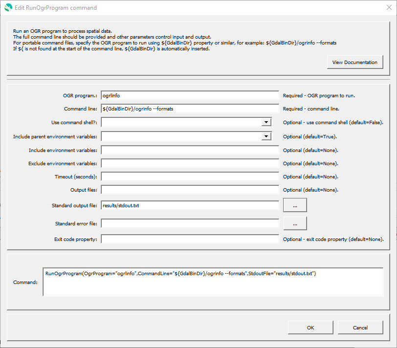

# GeoProcessor / Command / RunOgrProgram #

* [Overview](#overview)
* [Command Editor](#command-editor)
* [Command Syntax](#command-syntax)
* [Examples](#examples)
* [Troubleshooting](#troubleshooting)
* [See Also](#see-also)

-------------------------

## Overview ##

The `RunOgrProgram` command runs a command line OGR program to process vector data layer(s).
The GeoProcessor runs the program and waits until the program is finished before processing additional commands.
The GeoProcessor command will indicate a failure if the exit status from the program being run is non-zero.
This command is useful for running an external program that performs processing that the GeoProcessor cannot.
It is also useful to use the GeoProcessor’s testing features to implement quality control checks for software tools.

The GeoProcessor internally maintains a working folder (directory) that is used to convert relative paths to absolute paths to locate files.
The working folder is by default the location of the last command file that was opened.
However, the external program may assume that the working folder is the location from which GeoProcessor software was started
(or the installation location if started from a menu).
Therefore, it may be necessary to run the GeoProcessor in batch mode from the directory where the external
software’s data files exist, use absolute paths to files, or use the `${WorkingDir}` property in the command line.

Limitations of the command are as follows and will be addressed in future software updates:

* There is currently no way to handle double quotes in the command line.
* The command line must not exceed the length allowed by the operating system.

The following is the list of supported OGR programs, with links to documentation.

**<p style="text-align: center;">
OGR Command Line Programs
</p>**

| **OGR Program** | **Description** |
| -- | -- |
| [`ogrinfo`](http://gdal.org/programs/ogrinfo.html) | Lists information about an OGR-supported data source. |
| [`ogrlineref`](http://gdal.org/programs/ogrlineref.html) | Create linear reference and provide some calculations using it. |
| [`ogrmerge`](http://gdal.org/programs/ogrmerge.html) | Merge several vector datasets into a single one. |
| [`ogrtindex`](http://gdal.org/programs/ogrtindex.html) | Creates a tileindex. |
| [`ogr2ogr`](http://gdal.org/programs/ogr2ogr.html) | Converts simple features data between file formats. |

## Command Editor ##

The following dialog is used to edit the command and illustrates the command syntax
when running a program directly (without a command shell):

**<p style="text-align: center;">

</p>**

**<p style="text-align: center;">
`RunOgrProgram` Command Editor (<a href="../RunOgrProgram.png">see full-size image</a>)
</p>**

## Command Syntax ##

The command syntax is as follows:

```text
RunOgrProgram(Parameter="Value",...)
```
**<p style="text-align: center;">
Command Parameters
</p>**

| **Parameter**&nbsp;&nbsp;&nbsp;&nbsp;&nbsp;&nbsp;&nbsp;&nbsp;&nbsp;&nbsp;&nbsp;&nbsp;&nbsp;&nbsp;&nbsp;&nbsp;&nbsp;&nbsp;&nbsp;&nbsp;&nbsp;&nbsp;&nbsp;&nbsp;&nbsp;&nbsp; | **Description** | **Default**&nbsp;&nbsp;&nbsp;&nbsp;&nbsp;&nbsp;&nbsp;&nbsp;&nbsp;&nbsp; |
| --------------|-----------------|----------------- |
| `OgrProgram`<br>**required** | The name of the OGR command line program to run.  This is used to provide other information in the command editor. | None - must be specified. |
| `CommandLine`<br>**required** | The full command line with arguments arguments.  If the program executable is found in the `PATH` environment variable, then only the program name needs to be specified.  For portability, it is recommended that the command starts with `${GdalBinDir}`, which is the path to the folder containing OGR executable programs. If the command contains redirection or pipe characters, run using a command shell.<br><br>The `${WorkingDir}` property can be used in the command line to indicate the working directory (command file location) when specifying file names.  Other `${Property}` names can also be used. | None - must be specified. |
| `UseCommandShell` | If specified as `True`, the program will be run using a command shell.  A command shell is needed if the program is a script (batch file), a shell command, or uses `>`, `|`, etc. | `False`. |
| `IncludeParentEnvVars` | Indicate whether the parent environment variables should be passed to the program run environment by specifying (`True`) or ignore all parent environment variable (`False`).  Other parameters can be used to add additional environment variables or remove environment variables from the program run environment. | `True`. |
| `IncludeEnvVars` | Specify environment variables to be defined for the program run environment, using format `EnvVarName1=EnvVarValue1;EnvVarName2=EnvVarValue2;...`.  Other parameters can be used to add additional environment variables or remove environment variables from the program run environment. | |
| `ExcludeEnvVars` | Specify environment variables to be removed from the program run environment, using format `EnvVarName1,EnvVarName2,...`.  This parameter is processed after the parameters that define environment variables in the run environment.  Other parameters can be used to add additional environment variables or remove environment variables from the program run environment. | |
| `Timeout` | Timeout in seconds. | No timeout. |
| `OutputFiles` | Names of output files, separated by commas, to list in ***Results***.  Can use ${Property} notation. | |
| `StdoutFile` | File to capture standard output:<ul><li>Path to output file - to output to the specified file</li><li>`DEVNULL` - redirect to `/dev/null` (absorb)</li><li>`logfile` - append to the log file</li></ul> | Output to terminal window. |
| `StderrFile` | File to capture standard error:<ul><li>Path to output file - to output to the specified file</li><li>`DEVNULL` - redirect to `/dev/null` (absorb)</li><li>`STDOUT` - append to standard output</li><li>`logfile` - append to the log file</li></ul> | Output to terminal window. |
| `ExitCodeProperty` | Property name to set to the OGR program exit code. | |

## Examples ##

* See the [automated tests](https://github.com/OpenWaterFoundation/owf-app-geoprocessor-python-test/tree/master/test/commands/RunOgrProgram).

## Troubleshooting ##

## See Also ##

* [`RunGdalProgram`](../RunGdalProgram/RunGdalProgram.md) command
* [`RunProgram`](../RunProgram/RunProgram.md) command
