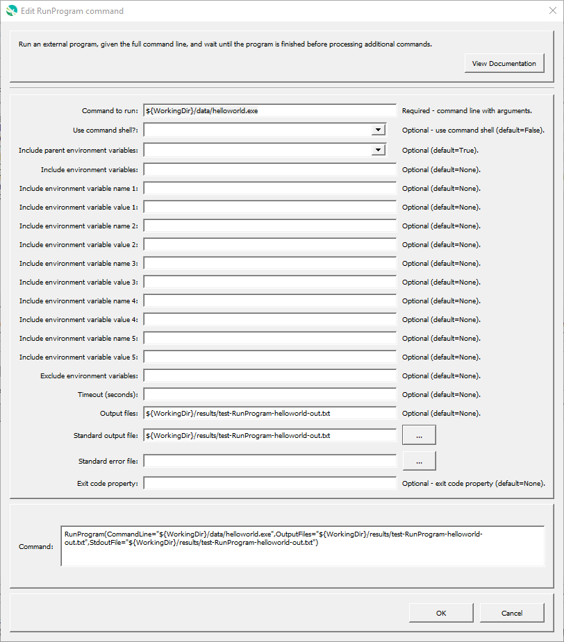

# GeoProcessor / Command / RunProgram #

* [Overview](#overview)
* [Command Editor](#command-editor)
* [Command Syntax](#command-syntax)
* [Examples](#examples)
* [Troubleshooting](#troubleshooting)
* [See Also](#see-also)

-------------------------

## Overview ##

The `RunProgram` command runs an external program, given the full command line,
and waits until the program is finished before processing additional commands.
The GeoProcessor command will indicate a failure if the exit status from the program being run is non-zero.
It is therefore possible to call an external program that reads and/or writes data formats to
perform processing that the GeoProcessor cannot.
One use of this command is to create a calibration environment where a model is run and then the
results are read and displayed using the GeoProcessor.
It is also useful to use the GeoProcessor’s testing features to implement quality control checks for other software tools.

The GeoProcessor internally maintains a working folder (directory) that is used to convert relative paths to absolute paths to locate files.
The working folder is by default the location of the last command file that was opened.
The external program may assume that the working folder is the location from which GeoProcessor software was started
(or the installation location if started from a menu).
Therefore, it may be necessary to run the GeoProcessor in batch mode from the directory where the external
software’s data files exist, use absolute paths to files, or use the `${WorkingDir}` property in the command line.

Limitations of the command are as follows and will be addressed in future software updates:

* There is currently no way to handle double quotes in the command line.
* The command line must not exceed the length allowed by the operating system.
* There is currently no `Timeout` parameter.
* There is currently no way to capture standard output or standard error from the command.

## Command Editor ##

The following dialog is used to edit the command and illustrates the command syntax
when running a program in a command shell configured with environment variables.



**<p style="text-align: center;">
`RunProgram` Command Editor (<a href="../RunProgram.png">see full-size image</a>)
</p>**

## Command Syntax ##

The command syntax is as follows:

```text
RunProgram(Parameter="Value",...)
```
**<p style="text-align: center;">
Command Parameters
</p>**

| **Parameter**&nbsp;&nbsp;&nbsp;&nbsp;&nbsp;&nbsp;&nbsp;&nbsp;&nbsp;&nbsp;&nbsp;&nbsp;&nbsp;&nbsp;&nbsp;&nbsp;&nbsp;&nbsp;&nbsp;&nbsp;&nbsp;&nbsp;&nbsp;&nbsp;&nbsp;&nbsp; | **Description** | **Default**&nbsp;&nbsp;&nbsp;&nbsp;&nbsp;&nbsp;&nbsp;&nbsp;&nbsp;&nbsp; |
| --------------|-----------------|----------------- |
| `CommandLine`<br>**required** | The full program command line, with arguments.  If the program executable is found in the `PATH` environment variable, then only the program name needs to be specified.  Otherwise, specify an absolute path to the program or run the GeoProcessor from a command shell in the same directory.  The command string can contain redirection and pipe characters.<br><br>The `${WorkingDir}` property can be used in the command line to indicate the working directory (command file location) when specifying file names.  Other `${Property}` names can also be used. | None - must be specified. |
| `UseCommandShell` | If specified as `True`, the program will be run using a command shell.  A command shell is needed if the program is a script (batch file), a shell command, or uses `>`, `|`, etc. | `False`. |
| `IncludeParentEnvVars` | Indicate whether the parent environment variables should be passed to the program run environment by specifying (`True`) or ignore all parent environment variable (`False`).  Other parameters can be used to add additional environment variables or remove environment variables from the program run environment. | `True`. |
| `IncludeEnvVars` | Specify environment variables to be defined for the program run environment, using format `EnvVarName1=EnvVarValue1;EnvVarName2=EnvVarValue2;...`.  Other parameters can be used to add additional environment variables or remove environment variables from the program run environment. | |
| `ExcludeEnvVars` | Specify environment variables to be removed from the program run environment, using format `EnvVarName1,EnvVarName2,...`.  This parameter is processed after the parameters that define environment variables in the run environment.  Other parameters can be used to add additional environment variables or remove environment variables from the program run environment. | |
| `IncludeEnvVarName1` ... `IncludeEnvVarName5` | Specify the name of as single environment variable to be defined for the program run environment.  Use this parameter with corresponding `IncludeEnvVarValue1` (through `IncludeEnvVarValue5`) as an alternative to the `IncludeEnvVars` parameter includes formatting that is difficult to parse due to special characters, etc.  Other parameters can be used to add additional environment variables or remove environment variables from the program run environment. |  |
| `IncludeEnvVarValue1` ... `IncludeEnvVarValue5` | Specify the value of as single environment variable to be defined for the program run environment.  Use this parameter with corresponding `IncludeEnvVarName1` (through `IncludeEnvVarName5`) as an alternative to the `IncludeEnvVars` parameter includes formatting that is difficult to parse due to special characters, etc.  Other parameters can be used to add additional environment variables or remove environment variables from the program run environment. |  |

## Examples ##

* See the [automated tests](https://github.com/OpenWaterFoundation/owf-app-geoprocessor-python-test/tree/master/test/commands/RunProgram).

## Troubleshooting ##

## See Also ##

* [RunCommands](../RunCommands/RunCommands.md) command
