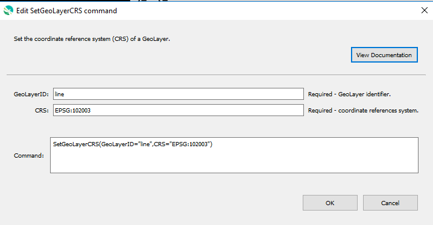

# GeoProcessor / Command / SetGeoLayerCRS #

*   [Overview](#overview)
*   [Command Editor](#command-editor)
*   [Command Syntax](#command-syntax)
*   [Examples](#examples)
*   [Troubleshooting](#troubleshooting)
*   [See Also](#see-also)

-------------------------

## Overview ##

The `SetGeoLayerCRS` command sets the [coordinate reference system (CRS)](https://en.wikipedia.org/wiki/Spatial_reference_system)
of a [GeoLayer](../../introduction/introduction.md#geolayer). 

This command:

*   Defines a coordinate reference system of a GeoLayer that has an `undefined` coordinate reference system.
*   Reprojects a GeoLayer with a `defined` coordinate reference system to a different coordinate reference system.

## Command Editor ##

The following dialog is used to edit the command and illustrates the command syntax.

**<p style="text-align: center;">

</p>**

**<p style="text-align: center;">
`SetGeoLayerCRS` Command Editor (<a href="../SetGeoLayerCRS.png">see full-size image</a>)
</p>**

## Command Syntax ##

The command syntax is as follows:

```text
SetGeoLayerCRS(Parameter="Value",...)
```

**<p style="text-align: center;">
Command Parameters
</p>**

|**Parameter**&nbsp;&nbsp;&nbsp;&nbsp;&nbsp;&nbsp;&nbsp;&nbsp;&nbsp;&nbsp;&nbsp;&nbsp;&nbsp;&nbsp;&nbsp;&nbsp;&nbsp;&nbsp;&nbsp;&nbsp;| **Description** | **Default**&nbsp;&nbsp;&nbsp;&nbsp;&nbsp;&nbsp;&nbsp;&nbsp;&nbsp;&nbsp; |
| --------------|-----------------|----------------- |
| `GeoLayerID` <br>**required**| The ID of the GeoLayer to set.| None - must be specified. |
| `CRS` <br> **required**|The [coordinate reference system](https://en.wikipedia.org/wiki/Spatial_reference_system). Must be in [EPSG or ESRI code format](http://spatialreference.org/ref/epsg/) (e.g. [`EPSG:4326`](http://spatialreference.org/ref/epsg/4326/), [`EPSG:26913`](http://spatialreference.org/ref/epsg/nad83-utm-zone-13n/), [`ESRI:102003`](http://spatialreference.org/ref/esri/usa-contiguous-albers-equal-area-conic/)).| None - must be specified. |

## Examples ##

See the [automated tests](https://github.com/OpenWaterFoundation/owf-app-geoprocessor-python-test/tree/main/test/commands/SetGeoLayerCRS).

The following GeoLayer data are used in the example. 
The examples assume that the GeoLayers have already been read into the GeoProcessor from a file.

**<p style="text-align: left;">
Example GeoLayer Data
</p>**

|GeoLayer ID|CRS|
| ---- | ---|
| ExampleGeoLayer1 |EPSG:4326 (WGS84)|
| ExampleGeoLayer2 |`None`|

### Example 1: Reproject a GeoLayer ###

```
SetGeoLayerCRS(GeoLayerID = "ExampleGeoLayer1", CRS = "EPSG:26913")
```

After running the command, the following GeoLayer IDs are registered within the GeoProcessor. 

|GeoLayer ID|CRS|
| ---- |---|
| ExampleGeoLayer1  |EPSG:26913 (NAD83 UTM Zone 13N)|
| ExampleGeoLayer2 |`None`|

### Example 2: Define a GeoLayer's CRS ###

```
SetGeoLayerCRS(GeoLayerID = "ExampleGeoLayer2", CRS = "EPSG:4326")
```

After running the command, the following GeoLayer IDs are registered within the GeoProcessor. 

|GeoLayer ID|CRS|
| ---- |---|
| ExampleGeoLayer1  |EPSG:4326 (WGS84)|
| ExampleGeoLayer2 |EPSG:4326 (WGS84)|

## Troubleshooting ##

## See Also ##

*   The GeoLayer is reprojected using the QGIS
    [`qgis:reprojectlayer`](https://docs.qgis.org/latest/en/docs/user_manual/processing_algs/qgis/vectorgeneral.html?highlight=reprojectlayer#reproject-layer)
    processing algorithm
*   The GeoLayer's CRS is defined using the QGIS
    [`qgis:definecurrentprojection`](https://docs.qgis.org/latest/en/docs/user_manual/processing_algs/qgis/vectorgeneral.html?highlight=reprojectlayer#define-shapefile-projection)
    processing algorithm
