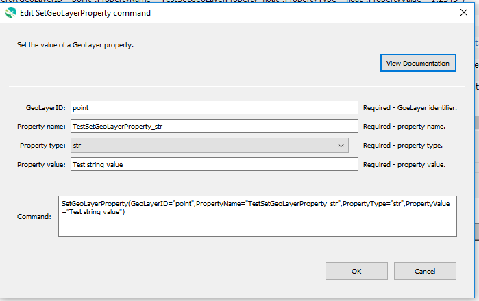

# GeoProcessor / Command / SetGeoLayerProperty #

* [Overview](#overview)
* [Command Editor](#command-editor)
* [Command Syntax](#command-syntax)
* [Examples](#examples)
* [Troubleshooting](#troubleshooting)
* [See Also](#see-also)

-------------------------

## Overview ##

The `SetGeoLayerProperty` command sets the value of a property on the GeoLayer.
The property will be available to subsequent commands that support using `${gl:Property}` notation in parameters.
One use for GeoLayer properties is to pass a layer property to the processor using
[`SetPropertyFromGeoLayer`](../SetPropertyFromGeoLayer/SetPropertyFromGeoLayer.md) commands to control processing logic.
GeoLayer properties may not be supported by spatial data formats and therefore may only be useful to control processing.
The following functionality is provided:

* Set a property to a specified value, where the property can be a Python primitive type: `bool`, `float`,
`int`, or `str`.

## Command Editor ##

The following dialog is used to edit the command and illustrates the command syntax.



**<p style="text-align: center;">
`SetGeoLayerProperty` Command Editor (<a href="../SetGeoLayerProperty.png">see full-size image</a>)
</p>**

## Command Syntax ##

The command syntax is as follows:

```text
SetGeoLayerProperty(Parameter="Value",...)
```
**<p style="text-align: center;">
Command Parameters
</p>**

| **Parameter**&nbsp;&nbsp;&nbsp;&nbsp;&nbsp;&nbsp;&nbsp;&nbsp;&nbsp;&nbsp;&nbsp;&nbsp;&nbsp;&nbsp;&nbsp;&nbsp;&nbsp;&nbsp;&nbsp;&nbsp;&nbsp;&nbsp;&nbsp;&nbsp;&nbsp;&nbsp; | **Description** | **Default**&nbsp;&nbsp;&nbsp;&nbsp;&nbsp;&nbsp;&nbsp;&nbsp;&nbsp;&nbsp; |
| --------------|-----------------|----------------- |
| `GeoLayerID` | The GeoLayer identifier, can use `${Property}`. | None - must be specified. |
| `PropertyName` | The property name. | None - must be specified. |
| `PropertyType` | The property type as `bool`, `float`, `int`, or `str`. | None - must be specified. |
| `PropertyValue` | The property value, as a string that can convert to the given type. | None - must be specified. |


## Examples ##

See the [automated tests](https://github.com/OpenWaterFoundation/owf-app-geoprocessor-python-test/tree/master/test/commands/SetGeoLayerProperty).

## Troubleshooting ##

## See Also ##

* [SetPropertyFromGeoLayer](../SetPropertyFromGeoLayer/SetPropertyFromGeoLayer.md) command.
