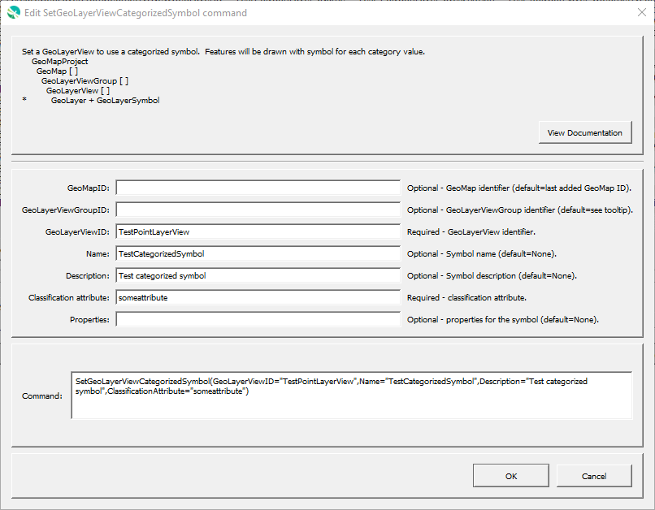

# GeoProcessor / Command / SetGeoLayerViewCategorizedSymbol #

*   [Overview](#overview)
*   [Command Editor](#command-editor)
*   [Command Syntax](#command-syntax)
*   [Examples](#examples)
*   [Troubleshooting](#troubleshooting)
*   [See Also](#see-also)

-------------------------

## Overview ##

The `SetGeoLayerViewCategorizedSymbol` command sets the symbol information for a GeoLayerView that has been previously added to a GeoMap,
using a categorized symbol.  Each category of features in the layer will be drawn with the same style.
An example of categorized data is a point layer with site types.
A GeoLayerView is an internal object that contains a GeoLayer (spatial data layer) and a GeoSymbol (visualization properties for layer).
This command is typically called after the [`AddGeoLayerViewToGeoMap`](../AddGeoLayerViewToGeoMap/AddGeoLayerViewToGeoMap.md) command.

*   See the [`CreateGeoMap`](../CreateGeoMap/CreateGeoMap.md) documentation for guidance on creating maps.
*   See the [GeoMapProject](../../appendix-geomapproject/geomapproject.md) documentation for background and GeoMapProject file format specification.

## Command Editor ##

The following dialog is used to edit the command and illustrates the command syntax.

**<p style="text-align: center;">

</p>**

**<p style="text-align: center;">
`SetGeoLayerViewCategorizedSymbol` Command Editor (<a href="../SetGeoLayerViewCategorizedSymbol.png">see full-size image</a>)
</p>**

## Command Syntax ##

The command syntax is as follows:

```text
SetGeoLayerViewCategorizedSymbol(Parameter="Value",...)
```
**<p style="text-align: center;">
Command Parameters
</p>**

| **Parameter**&nbsp;&nbsp;&nbsp;&nbsp;&nbsp;&nbsp;&nbsp;&nbsp;&nbsp;&nbsp;&nbsp;&nbsp;&nbsp;&nbsp;&nbsp;&nbsp;&nbsp;&nbsp;&nbsp;&nbsp;&nbsp;&nbsp;&nbsp;&nbsp;&nbsp;&nbsp;&nbsp;&nbsp;&nbsp;&nbsp;&nbsp;&nbsp; | **Description** | **Default**&nbsp;&nbsp;&nbsp;&nbsp;&nbsp;&nbsp;&nbsp;&nbsp;&nbsp;&nbsp;&nbsp;&nbsp;&nbsp;&nbsp;&nbsp;&nbsp;&nbsp;&nbsp; |
| --------------|-----------------|----------------- |
| `GeoMapID` | The ID of the existing GeoMap. | The ID of the last added GeoMap. |
| `GeoLayerViewGroupID` | The ID of the existing GeoLayerViewGroup. | The ID of the last added GeoLayerViewGroup. |
| `GeoLayerViewID` <br> **required** | The ID of the existing GeoLayerView. | None - must be specified. |
| `Name` | Name of the symbol, to help with managing symbols. | |
| `Description` | Description of the symbol, to help with managing symbols. | |
| `ClassificationAttribute`<br>**required** | <ul><li>**Vector layer**: The attribute that will be used for classification, which corresponds to the `value` column in the classification configuration file.</li><li>**Raster layer**: The band in the raster layer, which corresponds ot the `value` column in the classification configuration file.</li></ul> | None - must be specified. |
| `Properties` | Properties for the symbol using syntax `Property1:Value1,Property2,'Value 2'`.  Single quotes are used around values when the value contains special characters such as comma and spaces.  See the [GeoMapProject](../../appendix-geomapproject/geomapproject.md) documentation a list of properties. |  |

## Examples ##

See the [automated tests](https://github.com/OpenWaterFoundation/owf-app-geoprocessor-python-test/tree/main/test/commands/SetGeoLayerViewCategorizedSymbol).

## Troubleshooting ##

## See Also ##

*   [`AddGeoLayerViewGroupToGeoMap`](../AddGeoLayerViewGroupToGeoMap/AddGeoLayerViewGroupToGeoMap.md) command
*   [`AddGeoLayerViewToGeoMap`](../AddGeoLayerViewToGeoMap/AddGeoLayerViewToGeoMap.md) command
*   [`AddGeoMapToGeoMapProject`](../AddGeoMapToGeoMapProject/AddGeoMapToGeoMapProject.md) command
*   [`CreateGeoMap`](../CreateGeoMap/CreateGeoMap.md) command
*   [`CreateGeoMapProject`](../CreateGeoMapProject/CreateGeoMapProject.md) command
*   [`SetGeoLayerViewGraduatedSymbol`](../SetGeoLayerViewGraduatedSymbol/SetGeoLayerViewGraduatedSymbol.md) command
*   [`SetGeoLayerViewSingleSymbol`](../SetGeoLayerViewSingleSymbol/SetGeoLayerViewSingleSymbol.md) command
*   [`WriteGeoMapProjectToJSON`](../WriteGeoMapProjectToJSON/WriteGeoMapProjectToJSON.md) command
