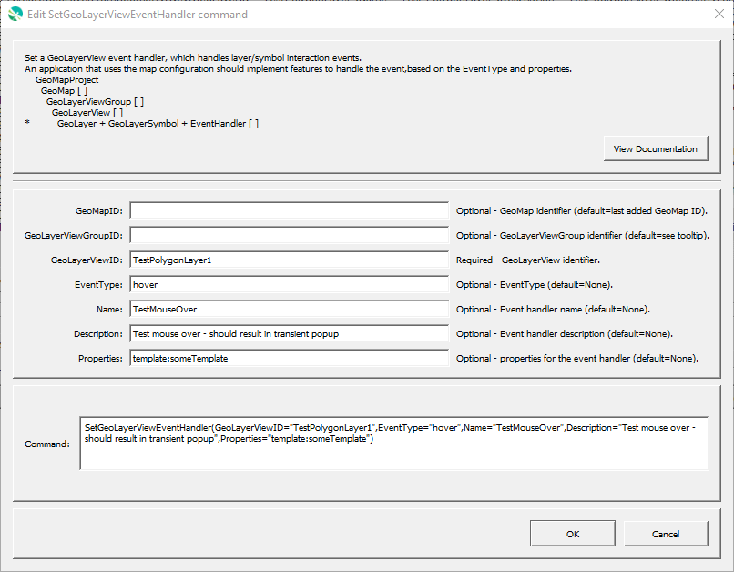

# GeoProcessor / Command / SetGeoLayerViewEventHandler #

* [Overview](#overview)
* [Command Editor](#command-editor)
* [Command Syntax](#command-syntax)
* [Examples](#examples)
* [Troubleshooting](#troubleshooting)
* [See Also](#see-also)

-------------------------

## Overview ##

The `SetGeoLayerViewEventHandler` command sets an event handlder for a GeoLayerView that has been previously added to a GeoMap.
The event handler is a concept that should be implemented in applications that use the GeoMap configuration file,
such as web applications and desktop mapping applications.
The properties of the event handler are flexible and are meant to allow general configuration in the GeoProcessor
while minimizing additional configuration in applications.

For example, a web application implemented using [Leaflet](https://leafletjs.com/) that reads
a map configuration file can interpret event handlers at startup to route events to appropriate application code.
The resulting application event handlers can then use the event handler properties defined by this command
to implement functionality.
For example, a property can be defined to tell the application what "template" view to display when a map layer feature is
hovered over or clicked on.
A point layer for streamflow stations might implement an event handler for the following types,
and multiple event handlers can e added for a GeoLayerView.

This command is typically called after the [`AddGeoLayerViewToGeoMap`](../AddGeoLayerViewToGeoMap/AddGeoLayerViewToGeoMap.md) command.

* See the [`CreateGeoMap`](../CreateGeoMap/CreateGeoMap.md) documentation for guidance on creating maps.
* See the [GeoMapProject](../../appendix-geomapproject/geomapproject.md) documentation for background and GeoMapProject file format specification.

**<p style="text-align: center;">
Possible Event Types
</p>**

| **Event Type** | **Description** |
| -- | -- |
| `hover` | Indicates hovering over a map layer feature or marker. |
| `click` | Indicates clicking on a map layer feature or marker. |

The `Properties` can be used to define additional event properties, such as whether a key press is required with a click event.
`Properties` can also be used to define actions to be taken
Additional guidelines and recommendations will be added as this command is used in projects.

## Command Editor ##

The following dialog is used to edit the command and illustrates the command syntax.

**<p style="text-align: center;">

</p>**

**<p style="text-align: center;">
`SetGeoLayerViewEventHandler` Command Editor (<a href="../SetGeoLayerViewEventHandler.png">see full-size image</a>)
</p>**

## Command Syntax ##

The command syntax is as follows:

```text
SetGeoLayerViewEventHandler(Parameter="Value",...)
```
**<p style="text-align: center;">
Command Parameters
</p>**

| **Parameter**&nbsp;&nbsp;&nbsp;&nbsp;&nbsp;&nbsp;&nbsp;&nbsp;&nbsp;&nbsp;&nbsp;&nbsp;&nbsp;&nbsp;&nbsp;&nbsp;&nbsp;&nbsp;&nbsp;&nbsp;&nbsp;&nbsp;&nbsp;&nbsp;&nbsp;&nbsp; | **Description** | **Default**&nbsp;&nbsp;&nbsp;&nbsp;&nbsp;&nbsp;&nbsp;&nbsp;&nbsp;&nbsp;&nbsp;&nbsp;&nbsp;&nbsp;&nbsp;&nbsp;&nbsp;&nbsp; |
| --------------|-----------------|----------------- |
| `GeoMapID` | The ID of the existing GeoMap. | The ID of the last added GeoMap. |
| `GeoLayerViewGroupID` | The ID of the existing GeoLayerViewGroup. | The ID of the last added GeoLayerViewGroup. |
| `GeoLayerViewID` <br> **required** | The ID of the existing GeoLayerView. | None - must be specified. |
| `EventType`<br>**required** | Type of event to be handled. | None - must be specified. |
| `Name` | Name of the event handler, to help with managing event handlers. | |
| `Description` | Description of the event handler, to help with managing event handlers. | |
| `Properties` | Properties for the symbol using syntax `Property1:Value1,Property2,'Value 2'`.  Single quotes are used around values when the value contains special characters such as comma and spaces.  See the [GeoMapProject](../../appendix-geomapproject/geomapproject.md) documentation a list of properties. |  |

## Examples ##

See the [automated tests](https://github.com/OpenWaterFoundation/owf-app-geoprocessor-python-test/tree/master/test/commands/SetGeoLayerViewEventHandler).

## Troubleshooting ##

## See Also ##

* [`AddGeoLayerViewGroupToGeoMap`](../AddGeoLayerViewGroupToGeoMap/AddGeoLayerViewGroupToGeoMap.md) command
* [`AddGeoLayerViewToGeoMap`](../AddGeoLayerViewToGeoMap/AddGeoLayerViewToGeoMap.md) command
* [`AddGeoMapToGeoMapProject`](../AddGeoMapToGeoMapProject/AddGeoMapToGeoMapProject.md) command
* [`CreateGeoMap`](../CreateGeoMap/CreateGeoMap.md) command
* [`CreateGeoMapProject`](../CreateGeoMapProject/CreateGeoMapProject.md) command
* [`SetGeoLayerViewCategorizedSymbol`](../SetGeoLayerViewCategorizedSymbol/SetGeoLayerViewCategorizedSymbol.md) command
* [`SetGeoLayerViewGraduatedSymbol`](../SetGeoLayerViewGraduatedSymbol/SetGeoLayerViewGraduatedSymbol.md) command
* [`SetGeoLayerViewSingleSymbol`](../SetGeoLayerViewSingleSymbol/SetGeoLayerViewSingleSymbol.md) command
* [`WriteGeoMapProjectToJSON`](../WriteGeoMapProjectToJSON/WriteGeoMapProjectToJSON.md) command
