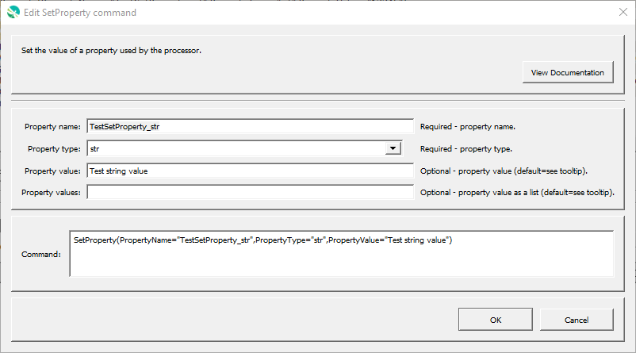

# GeoProcessor / Command / SetProperty #

* [Overview](#overview)
* [Command Editor](#command-editor)
* [Command Syntax](#command-syntax)
* [Examples](#examples)
* [Troubleshooting](#troubleshooting)
* [See Also](#see-also)

-------------------------

## Overview ##

The `SetProperty` command sets the value of a property used by the processor. The
property will be available to subsequent commands that support using `${Property}` notation in
parameters, for example to specify filenames more dynamically or use with `If` commands. This
command should not be confused with the `SetGeoLayerProperty` command, which sets a
property on specific GeoLayer. The following functionality is provided:

* Set a property to a specified value, where the property can be a Python primitive type: `bool`, `float`,
`int`, or `str`.
* Set a property as a list of `str`.

## Command Editor ##

The following dialog is used to edit the command and illustrates the command syntax.

**<p style="text-align: center;">

</p>**

**<p style="text-align: center;">
`SetProperty` Command Editor (<a href="../SetProperty.png">see full-size image</a>)
</p>**

## Command Syntax ##

The command syntax is as follows:

```text
SetProperty(Parameter="Value",...)
```
**<p style="text-align: center;">
Command Parameters
</p>**

| **Parameter**&nbsp;&nbsp;&nbsp;&nbsp;&nbsp;&nbsp;&nbsp;&nbsp;&nbsp;&nbsp;&nbsp;&nbsp;&nbsp;&nbsp;&nbsp;&nbsp;&nbsp;&nbsp;&nbsp;&nbsp;&nbsp;&nbsp;&nbsp;&nbsp;&nbsp;&nbsp; | **Description** | **Default**&nbsp;&nbsp;&nbsp;&nbsp;&nbsp;&nbsp;&nbsp;&nbsp;&nbsp;&nbsp; |
| --------------|-----------------|----------------- |
| `PropertyName`<br>**required** | The property name. | None - must be specified. |
| `PropertyType`<br>**required** | The property type as:<ul><li>`bool`</li><li>`float`</li><li>`int`</li><li>`str`</li></ul>. | None - must be specified. |
| `PropertyValue` | The property value, as a string that can convert to the given type. | Either `PropertyValue` or `PropertyValues` must be specified. |
| `PropertyValues` | The property values, as a list of string.  Currently, comma-separated values are supported with optional surrounding `[  ]`. In the future single-quoted strings will be supported to allow commas in the strings.  Strings are stripped of surrounding whitespace. | Either `PropertyValue` or `PropertyValues` must be specified. |

## Examples ##

See the [automated tests](https://github.com/OpenWaterFoundation/owf-app-geoprocessor-python-test/tree/master/test/commands/SetProperty).

## Troubleshooting ##

## See Also ##

* [`SetPropertyFromGeoLayer`](../SetPropertyFromGeoLayer/SetPropertyFromGeoLayer.md) command
* [`WritePropertiesToFile`](../WritePropertiesToFile/WritePropertiesToFile.md) command
