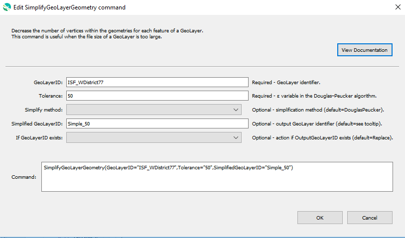

# GeoProcessor / Command / SimplifyGeoLayerGeometry #

* [Overview](#overview)
* [Command Editor](#command-editor)
* [Command Syntax](#command-syntax)
* [Douglas–Peucker Algorithm](#douglaspeucker-algorithm)
* [Examples](#examples)
* [Troubleshooting](#troubleshooting)
* [See Also](#see-also)

-------------------------

## Overview ##

The `SimplifyGeoLayerGeometry` command decreases the number of vertices within the geometries
for each feature of a [GeoLayer](../../introduction/introduction.md#geolayer).
This command is useful when the file size of a GeoLayer is too large. 

* This command is designed to simplify GeoLayers with `LINE` or `POLYGON` geometry by removing unnecessary vertices.
GeoLayers with `POINT` geometry *cannot* be simplified with this command.
* The file size of the simplified GeoLayer will be smaller than the input GeoLayer.
* The spatial accuracy of the simplified GeoLayer be less precise than the input GeoLayer. 

## Command Editor ##

The following dialog is used to edit the command and illustrates the command syntax.

**<p style="text-align: center;">

</p>**

**<p style="text-align: center;">
`SimplifyGeoLayerGeometry` Command Editor (<a href="../SimplifyGeoLayerGeometry.png">see full-size image</a>)
</p>**

## Command Syntax ##

The command syntax is as follows:

```text
SimplifyGeoLayerGeometry(Parameter="Value",...)
```
**<p style="text-align: center;">
Command Parameters
</p>**

|**Parameter**&nbsp;&nbsp;&nbsp;&nbsp;&nbsp;&nbsp;&nbsp;&nbsp;&nbsp;&nbsp;&nbsp;&nbsp;&nbsp;&nbsp;&nbsp;&nbsp;&nbsp;&nbsp;&nbsp;&nbsp;&nbsp;&nbsp;&nbsp;&nbsp;&nbsp;| **Description** | **Default**&nbsp;&nbsp;&nbsp;&nbsp;&nbsp;&nbsp;&nbsp;&nbsp;&nbsp;&nbsp;&nbsp;&nbsp;&nbsp;&nbsp;&nbsp;&nbsp;&nbsp;&nbsp;&nbsp;&nbsp;&nbsp;&nbsp;&nbsp;&nbsp;&nbsp;&nbsp;&nbsp;&nbsp;&nbsp;&nbsp;&nbsp;&nbsp;&nbsp;&nbsp;&nbsp;&nbsp;&nbsp;&nbsp;&nbsp;&nbsp;&nbsp;&nbsp;&nbsp;&nbsp;&nbsp;&nbsp;&nbsp;&nbsp;&nbsp;&nbsp; |
| --------------|-----------------|----------------- |
| `GeoLayerID` <br>**required**| The ID of the GeoLayer to be simplified.| None - must be specified. |
| `Tolerance`  <br>**required**| The `ε` variable in the `Douglas–Peucker algorithm`. <br><br>Units are the same as the distance units of the GeoLayer's coordinate reference system. For example, `WGS84 EPSG:4326` uses decimal degrees and `NAD83 Zone13N EPSG:26913` uses meters. Units for common coordinate reference systems can be looked up at the [epsg.io site](http://epsg.io/).<br><br> Refer to the [Douglas–Peucker Algorithm](#douglas-peuker-algorithim) section for more information. |None - must be specified. |
| `SimplifyMethod` | The simplification method used to simplify the GeoLayer:<ul><li>`DouglasPeucker` - Use the [Douglas-Peucker algorithm](https://en.wikipedia.org/wiki/Ramer%E2%80%93Douglas%E2%80%93Peucker_algorithm) to simplify the GeoLayer.</li></ul>|`DouglasPeucker`|
| `SimplifiedGeoLayerID`| A GeoLayer identifier for the output simplified GeoLayer. Refer to [documentation](http://127.0.0.1:8000/best-practices/geolayer-identifiers/) for best practices on naming GeoLayer identifiers.|`GeoLayerID``_simple_``Tolerance`|
|`IfGeoLayerIDExists`|The action that occurs if the `SimplifiedGeoLayerID` already exists within the GeoProcessor:<ul><li>`Replace` - The existing GeoLayer within the GeoProcessor is replaced with the new GeoLayer. No warning is logged.</li><li>`ReplaceAndWarn` - The existing GeoLayer within the GeoProcessor is replaced with the new GeoLayer. A warning is logged.</li><li>`Warn` - The `SimplifyGeoLayerGeometry` command does not run. A warning is logged.</li><li>`Fail` - The `SimplifyGeoLayerGeometry` command does not run. A fail message is logged.</li></ul> | `Replace` | 

## Douglas–Peucker Algorithm

The `SimplifyGeoLayerGeometry` command simplifies the features of a GeoLayer with the
[`Douglas–Peucker algorithim`](https://en.wikipedia.org/wiki/Ramer%E2%80%93Douglas%E2%80%93Peucker_algorithm). 

A line is specified by multiple points (coordinates) in sequence.
The algorithm discards points as long as the resulting shift in the line connecting remaining points does not exceed the tolerance.
A very small tolerance would only discard points that are "extra" points along a straight line.

#### Additional Resources

* [Spatial Analysis 1., Spatial Data Handling](http://www.tankonyvtar.hu/hu/tartalom/tamop425/0027_SAN1/ch01s05.html) 
* [Reducing a Map Path Using Douglas-Peucker Algorithm](https://www.eandbsoftware.org/reducing-a-map-path-using-douglas-peucker-algorithm/)
* [Polyline Simplification](https://www.codeproject.com/Articles/114797/Polyline-Simplification)

## Examples ##

See the [automated tests](https://github.com/OpenWaterFoundation/owf-app-geoprocessor-python-test/tree/master/test/commands/SimplifyGeoLayerGeometry).

The following GeoLayer data are used in the examples.
The examples assume that the GeoLayer has *already* been read into the GeoProcessor from a file. 

**<p style="text-align: left;">
Example GeoLayer Data
</p>**

|GeoLayer ID|CRS|File Size (if written out to GeoJSON)|
| ---- | ---|---|
|`SummitCounty`|EPSG:26913 (NAD83 UTM Zone 13N)|90 KB|

This example GeoLayer is from the `polygon_summit_co_nad83_utm_z13n.geojson` test data file.

|`SummitCounty`|
|-|
||

### Example 1: Simplify a GeoLayer (Small Tolerance)###

```
SimplifyGeoLayerGeometry(GeoLayerID = "SummitCounty", Tolerance = "100", SimplifiedGeoLayerID = "Summit_simple100" )
```

After running the command, the following GeoLayer IDs are registered within the GeoProcessor. 

|GeoLayer ID|File Size (if written out to GeoJSON)|
| ---- | ---|
|`SummitCounty`|90 KB|
|`Summit_simple100`|11 KB|

|`Summit_simple100`&nbsp;&nbsp;&nbsp;&nbsp;&nbsp;&nbsp;&nbsp;&nbsp;&nbsp;&nbsp;&nbsp;&nbsp;&nbsp;&nbsp;&nbsp;&nbsp;&nbsp;&nbsp;&nbsp;&nbsp;&nbsp;&nbsp;Tolerance Value: 100 meters |
|-|
||

|The simplified GeoLayer looks similar to the original GeoLayer. Below is an image of the two GeoLayers at a larger scale. |
|--|
||

### Example 2: Simplify a GeoLayer (Large Tolerance)###

```
SimplifyGeoLayerGeometry(GeoLayerID = "SummitCounty", Tolerance = "1000")
```

After running the command, the following GeoLayer IDs are registered within the GeoProcessor. 

|GeoLayer ID|File Size (if written out to GeoJSON)|
| ---- | ---|
| `SummitCounty` |90 KB|
|`SummitCounty_simple_1000`|2 KB|

|`SummitCounty_simple_1000` &nbsp;&nbsp;&nbsp;&nbsp;&nbsp;&nbsp;&nbsp;&nbsp;&nbsp;&nbsp;&nbsp;&nbsp;&nbsp;&nbsp;&nbsp;&nbsp;&nbsp;&nbsp;&nbsp;&nbsp;&nbsp;&nbsp;Tolerance Value: 1000 meters |
|-|
||

## Troubleshooting ##

## See Also ##

* This command uses the QGIS [`qgis:simplifygeometries`](https://docs.qgis.org/latest/en/docs/user_manual/processing_algs/qgis/vectorgeometry.html#simplify) processing algorithm
