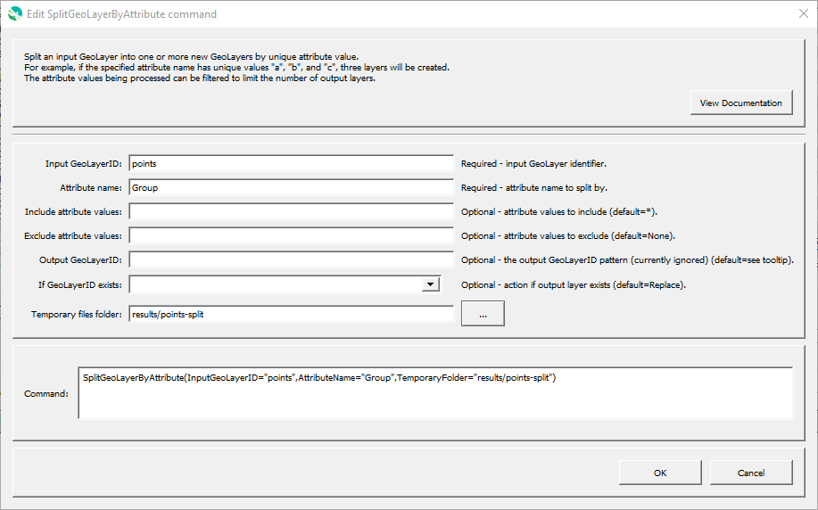

# GeoProcessor / Command / SplitGeoLayerByAttribute #

* [Overview](#overview)
* [Command Editor](#command-editor)
* [Command Syntax](#command-syntax)
* [Examples](#examples)
* [Troubleshooting](#troubleshooting)
* [See Also](#see-also)

-------------------------

## Overview ##

The `SplitGeoLayerByAttribute` splits a GeoLayer into one or more new GeoLayers
by filtering on an attribute,
using the `gdal:splitvectorlayer` algorithm.
See the [latest GGIS split layer view](https://docs.qgis.org/latest/en/docs/user_manual/processing_algs/qgis/vectorgeneral.html#split-vector-layer) documentation.

The initial layers that are split are saved to temporary files using
[GeoPackage file](../../spatial-data-format-ref/GeoPackage/GeoPackage.md) format.
These files are then read as layers.
The QGIS tool does not allow controlling which attributes are processed.
However, the GeoProcessor command allows filtering on attribute by only reading temporary file layers that match the requested attributes.

## Command Editor ##

The following dialog is used to edit the command and illustrates the command syntax.

**<p style="text-align: center;">

</p>**

**<p style="text-align: center;">
`SplitGeoLayerByAttribute` Command Editor (<a href="../SplitGeoLayerByAttribute.png">see full-size image</a>)
</p>**

## Command Syntax ##

The command syntax is as follows:

```text
SplitGeoLayerByAttribute(Parameter="Value",...)
```
**<p style="text-align: center;">
Command Parameters
</p>**

|**Parameter**&nbsp;&nbsp;&nbsp;&nbsp;&nbsp;&nbsp;&nbsp;&nbsp;&nbsp;&nbsp;&nbsp;&nbsp;&nbsp;&nbsp;&nbsp;&nbsp;&nbsp;&nbsp;&nbsp;&nbsp;&nbsp;&nbsp;&nbsp;&nbsp;&nbsp;&nbsp;&nbsp;&nbsp;&nbsp; | **Description** | **Default**&nbsp;&nbsp;&nbsp;&nbsp;&nbsp;&nbsp;&nbsp;&nbsp;&nbsp;&nbsp; |
| --------------|-----------------|----------------- |
| `InputGeoLayerID`<br>**required** | The GeoLayer identifier corresponding to the layer to be split.  [`${Property}` syntax](../../introduction/introduction.md#geoprocessor-properties-property) is recognized. | None - must be specified. |
| `AttributeName`<br>**required** | The attribute name to determine values for the output layers. | None - must be specified. |
| `IncludeAttributeValues` | Attribute values to include.  This only controls which temporary layer files are read in as new layers. | Include all attributes. |
| `ExcludeAttributeValues` | Attribute values to exclude.  This only controls which temporary layer files are read in as new layers. | Include all attributes (don't exclude any). |
| `OutputGeoLayerID` | A GeoLayer identifier. [Formatting characters](../../introduction/introduction.md#geolayer-property-format-specifiers) and [`${Property}` syntax](../../introduction/introduction.md#geoprocessor-properties-property) is recognized. This is currently ignored and the default value is used, which is `InputGeoLayerID_AttributeName_AttributeValue`. Refer to [documentation](../../best-practices/geolayer-identifiers.md) for best practices on naming GeoLayer identifiers.| `InputGeoLayerID_AttributeName_AttributeValue`. |
| `IfGeoLayerIDExists` | The action that occurs if the `GeoLayerID` already exists within the GeoProcessor:<ul><li>`Replace` - The existing GeoLayer within the GeoProcessor is replaced with the new GeoLayer. No warning is logged.</li><li>`ReplaceAndWarn` - The existing GeoLayer within the GeoProcessor is replaced with the new GeoLayer. A warning is logged.</li><li>`Warn` - The new GeoLayer is not created. A warning is logged.</li><li>`Fail` - The new GeoLayer is not created. A fail message is logged.</li></ul> | `Replace` | 
| `TemporaryFolder` | Path to folder where temporary layer files are created, useful for troubleshooting and managing files. | Temporary folder for the operating system. |

## Examples ##

See the [automated tests](https://github.com/OpenWaterFoundation/owf-app-geoprocessor-python-test/tree/master/test/commands/SplitGeoLayerByAttribute).

## Troubleshooting ##

## See Also ##

* QGIS 3.10 split vector layer documentation:
	+ [QGIS latest split vector layer](https://docs.qgis.org/latest/en/docs/user_manual/processing_algs/qgis/vectorgeneral.html#split-vector-layer) documentation
	+ [QGIS 3.10 split vector layer](https://docs.qgis.org/3.10/en/docs/user_manual/processing_algs/qgis/vectorgeneral.html#split-vector-layer) documentation
* [GeoPackage file](../../spatial-data-format-ref/GeoPackage/GeoPackage.md) format
