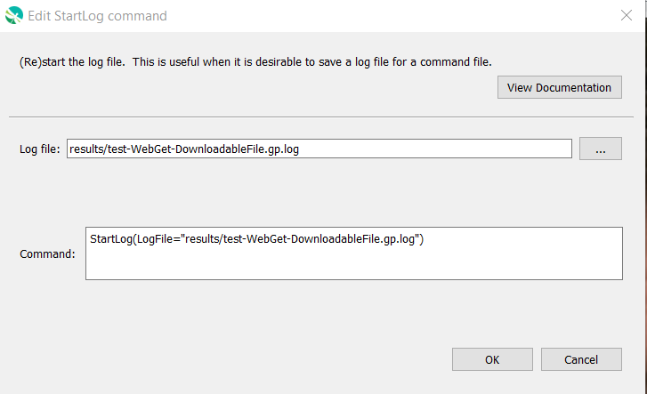

# GeoProcessor / Command / StartLog #

*   [Overview](#overview)
*   [Command Editor](#command-editor)
*   [Command Syntax](#command-syntax)
*   [Examples](#examples)
*   [Troubleshooting](#troubleshooting)
*   [See Also](#see-also)

-------------------------

## Overview ##

The `StartLog` command (re)starts the log file. It is useful to insert this command as the first
command in a command file, in order to persistently record the results of processing. A useful standard is
to name the log file the same as the command file, with an additional `.log` extension, and this convention
is enforced by default.

## Command Editor ##

The following dialog is used to edit the command and illustrates the command syntax.

**<p style="text-align: center;">

</p>**

**<p style="text-align: center;">
`StartLog` Command Editor (<a href="../StartLog.png">see full-size image</a>)
</p>**

## Command Syntax ##

The command syntax is as follows:

```text
StartLog(Parameter="Value",...)
```
**<p style="text-align: center;">
Command Parameters
</p>**

| **Parameter**&nbsp;&nbsp;&nbsp;&nbsp;&nbsp;&nbsp;&nbsp;&nbsp;&nbsp;&nbsp;&nbsp;&nbsp;&nbsp;&nbsp;&nbsp;&nbsp;&nbsp;&nbsp;&nbsp;&nbsp;&nbsp;&nbsp;&nbsp;&nbsp;&nbsp;&nbsp; | **Description** | **Default**&nbsp;&nbsp;&nbsp;&nbsp;&nbsp;&nbsp;&nbsp;&nbsp;&nbsp;&nbsp; |
| --------------|-----------------|----------------- |
| `LogFile`<br>**required** | The name of the file to write.  Can be specified using `${Property}`. | None - must be specified. |

## Examples ##

See the [automated tests](https://github.com/OpenWaterFoundation/owf-app-geoprocessor-python-test/tree/main/test/commands/StartLog).

## Troubleshooting ##

## See Also ##

*   [`Message`](../Message/Message.md) command - can be used to write messages to the log file
