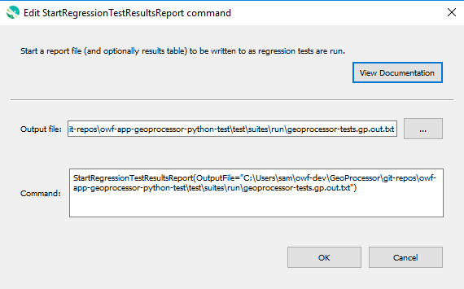

# GeoProcessor / Command / StartRegressionTestResultsReport #

*   [Overview](#overview)
*   [Command Editor](#command-editor)
*   [Command Syntax](#command-syntax)
*   [Examples](#examples)
*   [Troubleshooting](#troubleshooting)
*   [See Also](#see-also)

-------------------------

## Overview ##

The `StartRegressionTestResultsReport` command starts a report file (and in the future an optional results table) to be written to as regression tests are run.
The [`CreateRegressionTestCommandFile`](../CreateRegressionTestCommandFile/CreateRegressionTestCommandFile.md) command automatically
inserts this command and is the preferred way to set up automated tests.
The results from the [`RunCommands`](../RunCommands/RunCommands.md)
commands run in the test suite will be written to the results file (and, in the future, the optional results table) if available.

## Command Editor ##

The following dialog is used to edit the command and illustrates the command syntax.

**<p style="text-align: center;">

</p>**

**<p style="text-align: center;">
`StartRegressionTestResultsReport` Command Editor (<a href="../StartRegressionTestResultsReport.png">see full-size image</a>)
</p>**

## Command Syntax ##

The command syntax is as follows:

```text
StartRegressionTestResultsReport(Parameter="Value",...)
```
**<p style="text-align: center;">
Command Parameters
</p>**

| **Parameter**&nbsp;&nbsp;&nbsp;&nbsp;&nbsp;&nbsp;&nbsp;&nbsp;&nbsp;&nbsp;&nbsp;&nbsp;&nbsp;&nbsp;&nbsp;&nbsp;&nbsp;&nbsp;&nbsp;&nbsp;&nbsp;&nbsp;&nbsp;&nbsp;&nbsp;&nbsp; | **Description** | **Default**&nbsp;&nbsp;&nbsp;&nbsp;&nbsp;&nbsp;&nbsp;&nbsp;&nbsp;&nbsp; |
| --------------|-----------------|----------------- |
| `OutputFile`<br>**required** | The regression results report file to write, as an absolute path or relative to the command file.  Can use `${Property}`.<br><br>An output file with `nonum` in its name will also be written after the initial test file is completed, with test numbers replaced by spaces, which allows more straightforward comparison with other test results files. | None - must be specified. |

## Examples ##

*   See the [GeoProcessor test suites](https://github.com/OpenWaterFoundation/owf-app-geoprocessor-python-test/tree/master/test/suites/).

## Troubleshooting ##

## See Also ##

*   [`CreateRegressionTestCommandFile`](../CreateRegressionTestCommandFile/CreateRegressionTestCommandFile.md) command
*   [`RunCommands`](../RunCommands/RunCommands.md) command
*   [`WriteCommandSummaryToFile`](../WriteCommandSummaryToFile/WriteCommandSummaryToFile.md) command
