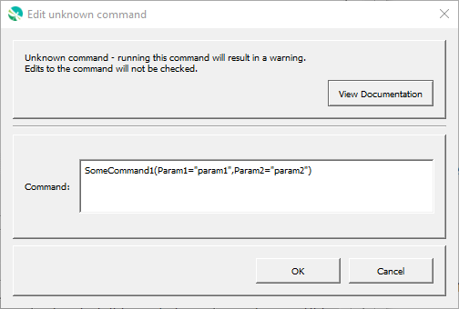

# GeoProcessor / Command / UnknownCommand #

*   [Overview](#overview)
*   [Command Editor](#command-editor)
*   [Command Syntax](#command-syntax)
*   [Examples](#examples)
*   [Troubleshooting](#troubleshooting)
*   [See Also](#see-also)

-------------------------

## Overview ##

The `UnknownCommand` is used for commands that are not recognized as valid commands.
The command string can be edited but the processor will generate a warning when running.

## Command Editor ##

The following dialog is used to edit the command and illustrates the command syntax.

**

**

**

Unknown Command Editor (<a href="../UnknownCommand.png">see full-size image</a>)

**

## Command Syntax ##

Unrecognized commands in command files are converted to `UnknownCommand` commands.

## Examples ##

See the [automated tests](https://github.com/OpenWaterFoundation/owf-app-geoprocessor-python-test/tree/main/test/commands/UnknownCommand).

## Troubleshooting ##

## See Also ##

*   [Blank](../Blank/Blank.md) command - used for empty lines
