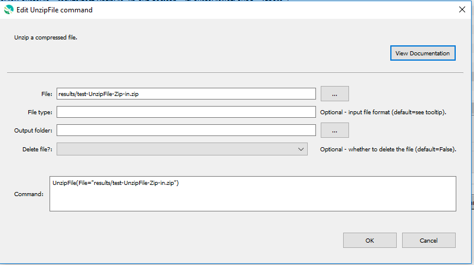

# GeoProcessor / Command / UnzipFile #

*   [Overview](#overview)
*   [Command Editor](#command-editor)
*   [Command Syntax](#command-syntax)
*   [Examples](#examples)
*   [Troubleshooting](#troubleshooting)
*   [See Also](#see-also)

-------------------------

## Overview ##

The `UnzipFile` command unzips a compressed file. 

*   The compressed file can contain one or more files and/or folders. 
*   Can unzip `zip` and `tar` files.

## Command Editor ##

The following dialog is used to edit the command and illustrates the command syntax.

**<p style="text-align: center;">

</p>**

**<p style="text-align: center;">
`UnzipFile` Command Editor (<a href="../UnzipFile.png">see full-size image</a>)
</p>**

## Command Syntax ##

The command syntax is as follows:

```text
UnzipFile(Parameter="Value",...)
```
**<p style="text-align: center;">
Command Parameters
</p>**

|**Parameter**&nbsp;&nbsp;&nbsp;&nbsp;&nbsp;&nbsp;&nbsp;&nbsp;  | **Description** | **Default**&nbsp;&nbsp;&nbsp;&nbsp;&nbsp;&nbsp;&nbsp;&nbsp;&nbsp;&nbsp;&nbsp;&nbsp;&nbsp;&nbsp;&nbsp;&nbsp;&nbsp;&nbsp;&nbsp;&nbsp; |
| --------------|-----------------|----------------- |
| `File` <br> **required**| The file to be unzipped (relative or absolute path). [`${Property}` syntax](../../introduction/introduction.md#geoprocessor-properties-property) is recognized.| None - must be specified. |
| `FileType`| The file format of the input `File`:<ul><li>`tar` -  [.tar file](https://en.wikipedia.org/wiki/Tar_(computing))</li><li>`zip` - [.zip file](https://en.wikipedia.org/wiki/Zip_(file_format))</li></ul>| Determined from the `File` extension. |
| `OutputFolder` | The name of the output folder, where extracted files are saved. [`${Property}` syntax](../../introduction/introduction.md#geoprocessor-properties-property) is recognized.|The parent folder of the `File`.|
| `IfFolderDoesNotExist` | Action to perform if the folder does not exist: <ul><li>`Create` - create the folder</li><li>`Warn` - generate a warning</li><li>`Fail` - generate a failure message</li></ul> | `Warn` |
| `DeleteFile` | Indicates whether to delete the file after unzipping:<ul><li>`True` - the compressed file is deleted after the extraction.</li><li>`False` - the compressed file remains after the extraction.</li></ul>| `False`|

## Examples ##

See the [automated tests](https://github.com/OpenWaterFoundation/owf-app-geoprocessor-python-test/tree/main/test/commands/UnzipFile).

### Example 1: Unzip a Zip File to the Command File Folder ###

```
UnzipFile(File = "ExampleFolder/ExampleFile.zip")
```

### Example 2: Unzip a Zip File to a Different Folder ###

The output folder is relative to the command file folder.

```
UnzipFile(File = "ExampleFolder/ExampleFile.zip",OutputFolder="ExampleFolder/ExampleSubFolder")
```

## Troubleshooting ##

## See Also ##

*   [`WebGet`](../WebGet/WebGet.md) command
