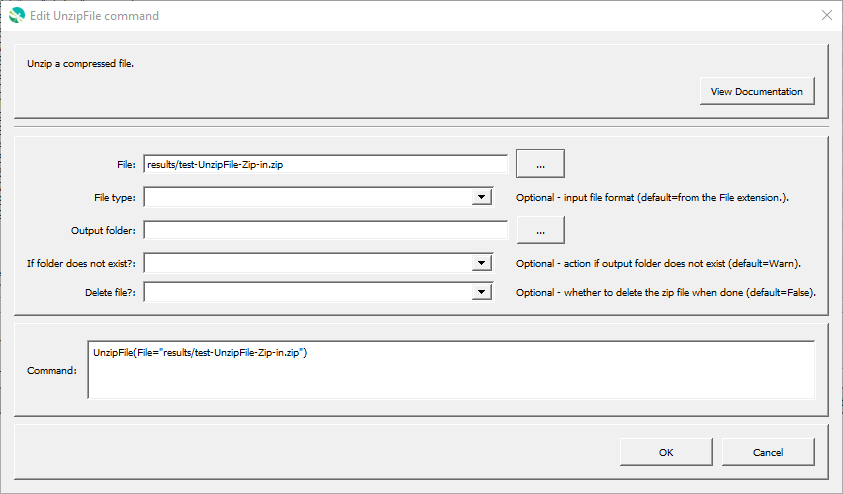

# GeoProcessor / Command / UnzipFile #

* [Overview](#overview)
* [Command Editor](#command-editor)
* [Command Syntax](#command-syntax)
* [Examples](#examples)
* [Troubleshooting](#troubleshooting)
* [See Also](#see-also)

-------------------------

## Overview ##

The `UnzipFile` command unzips a compressed file. 

* The compressed file can contain one or more files and/or folders. 
* Can unzip numerous types of [compressed files](https://en.wikipedia.org/wiki/List_of_archive_formats) (not specific to `.zip` files.)

## Command Editor ##

The following dialog is used to edit the command and illustrates the command syntax.

**<p style="text-align: center;">

</p>**

**<p style="text-align: center;">
`UnzipFile` Command Editor (<a href="../UnzipFile.png">see full-size image</a>)
</p>**

## Command Syntax ##

The command syntax is as follows:

```text
UnzipFile(Parameter="Value",...)
```
**<p style="text-align: center;">
Command Parameters
</p>**

|**Parameter**&nbsp;&nbsp;&nbsp;&nbsp;&nbsp;&nbsp;&nbsp;&nbsp;  | **Description** | **Default**&nbsp;&nbsp;&nbsp;&nbsp;&nbsp;&nbsp;&nbsp;&nbsp;&nbsp;&nbsp;&nbsp;&nbsp;&nbsp;&nbsp;&nbsp;&nbsp;&nbsp;&nbsp;&nbsp;&nbsp; |
| --------------|-----------------|----------------- |
| `File` <br> **required**| The file to be unzipped (relative or absolute path). [`${Property}` syntax](../../introduction/introduction.md#geoprocessor-properties-property) is recognized.| None - must be specified. |
| `FileType` <br> |The file format of the input `File`. The following file formats are currently accepted. <br><br> `TAR`: a [.tar file](https://en.wikipedia.org/wiki/Tar_(computing)). <br> `ZIP`: A [.zip file](https://en.wikipedia.org/wiki/Zip_(file_format)).| Determined from the `File`'s extension. |
|`OutputFolder` |The name of the destination folder. The extracted files are saved here. [`${Property}` syntax](../../introduction/introduction.md#geoprocessor-properties-property) is recognized.|The parent folder of the `File`.|
|`DeleteFile` | Indicates whether to delete the file after unzipping:<ul><li>`True` - the compressed file is deleted after the extraction.</li><li>`False` - the compressed file remains after the extraction.</li></ul>| `False`|

## Examples ##

See the [automated tests](https://github.com/OpenWaterFoundation/owf-app-geoprocessor-python-test/tree/master/test/commands/UnzipFile).

The following folder, `ExampleFolder`, and its contents are used for the examples. 
The `ExampleFolder` is not an actual existing folder.
It is used in this documentation to explain how the `UnzipFile` command interacts with similar, existing folders on your local machine.

**<p style="text-align: left;">
ExampleFolder
</p>**

|Name|Folder/File|
| ---- |---|
| ExampleFile.zip |File|
| ExampleSubFolder| Folder|

**<p style="text-align: left;">
Archived contents of ExampleFile.zip
</p>**

|Files|
|-|
|ExampleFile1.geojson|
|ExampleFile2.txt|

### Example 1: Unzip a Zip File ###

```
UnzipFile(File = "ExampleFolder/ExampleFile.zip")
```

After running the command, the following files are written to the `ExampleFolder`. Note that, by default, the original zipped file remains after the extraction. 

|ExampleFolder|
|------|
|ExampleFile1.geojson|
|ExampleFile2.txt|
|ExampleFile.zip |
|ExampleSubFolder|

### Example 2: Unzip a Zip File to a Different Folder ###

```
UnzipFile(File = "ExampleFolder/ExampleFile.zip", OutputFolder = "ExampleFolder/ExampleSubFolder")
```
After running the command, the following files are written to the `ExampleFolder`. 

|ExampleFolder|
|------|
| ExampleFile.zip |
| ExampleSubFolder|

After running the command, the following files are written to the `ExampleSubFolder`. 

|ExampleSubFolder|
|-----|
|ExampleFile1.geojson|
|ExampleFile2.txt|

## Troubleshooting ##

## See Also ##

* [`WebGet`](../WebGet/WebGet.md) command
