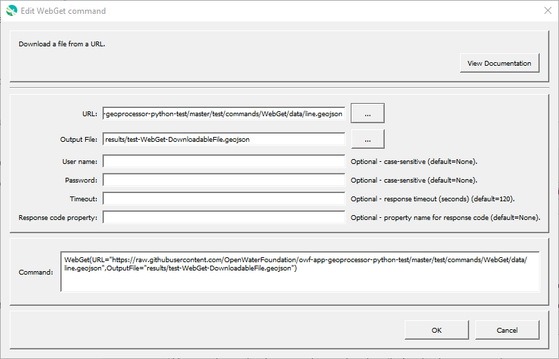

# GeoProcessor / Command / WebGet #

* [Overview](#overview)
* [Command Editor](#command-editor)
* [Command Syntax](#command-syntax)
* [Examples](#examples)
* [Troubleshooting](#troubleshooting)
* [See Also](#see-also)

-------------------------

## Overview ##

The `WebGet` command downloads a file or other web resource from a URL source. Common uses of this command are:

* Download data files
* Query web services 
* Can specify a username and password if the URL is secured.

## Command Editor ##

The following dialog is used to edit the command and illustrates the command syntax.

**<p style="text-align: center;">

</p>**

**<p style="text-align: center;">
`WebGet` Command Editor (<a href="../WebGet.png">see full-size image</a>)
</p>**

## Command Syntax ##

The command syntax is as follows:

```text
WebGet(Parameter="Value",...)
```
**<p style="text-align: center;">
Command Parameters
</p>**

|**Parameter**&nbsp;&nbsp;&nbsp;&nbsp;&nbsp;&nbsp;&nbsp;&nbsp;&nbsp;&nbsp;&nbsp;&nbsp;&nbsp;&nbsp;&nbsp;&nbsp;&nbsp;&nbsp;&nbsp;&nbsp;&nbsp;&nbsp;&nbsp;&nbsp; | **Description** | **Default**&nbsp;&nbsp;&nbsp;&nbsp;&nbsp;&nbsp;&nbsp;&nbsp;&nbsp;&nbsp;&nbsp;&nbsp;&nbsp;&nbsp;&nbsp;&nbsp; |
| --------------|-----------------|----------------- |
| `URL` <br>**required** | The URL of the resource to download. [`${Property}` syntax](../../introduction/introduction.md#geoprocessor-properties-property) is recognized. | None - must be specified. |
| `OutputFile` | The output file path (relative or absolute). [`${Property}` syntax](../../introduction/introduction.md#geoprocessor-properties-property) is recognized. [Formatting character (%f)](../../introduction/introduction.md#geolayer-property-format-specifiers) is recognized. If the output file exists, it will be overwritten. | Same filename as source. Saved to the parent folder of the `.gp` workflow. |
| `Username` | A valid username to access a private URL file. |`None` - the URL is downloaded as a public file. |
| `Password` | A valid password to access a private URL file. |`None` - the URL is downloaded as a public file. |
| `Timeout` | Timeout in seconds. The timeout will ensure that the software does not pause indefinitely. | `120` |
| `ResponseCodeProperty` | Property name to set to the [HTTP response code](https://en.wikipedia.org/wiki/List_of_HTTP_status_codes). This can be used to check for download errors. | |

## Examples ##

See the [automated tests](https://github.com/OpenWaterFoundation/owf-app-geoprocessor-python-test/tree/master/test/commands/WebGet).

### Example 1: Using the `%f` Formatting Character in the `OutputFile` Parameter###

```
WebGet(URL="https://rmgsc.cr.usgs.gov/outgoing/GeoMAC/2015_fire_data/Florida/Mystery_Hammock_Wf/fl_mystery_hammock_wf_20150817_0000_dd83.cpg",OutputFile="ExampleOutputFolder/NewFilename")
WebGet(URL="https://rmgsc.cr.usgs.gov/outgoing/GeoMAC/2015_fire_data/Florida/Mystery_Hammock_Wf/fl_mystery_hammock_wf_20150817_0000_dd83.cpg",OutputFile="ExampleOutputFolder/%f")
```

The two commands download the same [data file](https://rmgsc.cr.usgs.gov/outgoing/GeoMAC/2015_fire_data/Florida/Mystery_Hammock_Wf/fl_mystery_hammock_wf_20150817_0000_dd83.cpg). 

- The first command specifies a different filename using the `OutputFile` parameter.
  The name of the downloaded file is renamed to the specified filename. 
- The second command utilizes the `%f` [formatting character](../../introduction/introduction.md#geolayer-property-format-specifiers)
  in the `OutputFile` parameter. The name of the downloaded file is the same as the URL filename.

## Troubleshooting ##

## See Also ##

* The files are downloaded using the Python [Requests](http://docs.python-requests.org/en/master/) library.
* [`FTPGet`](../FTPGet/FTPGet.md) command
* [`ListFiles`](../ListFiles/ListFiles.md) command
