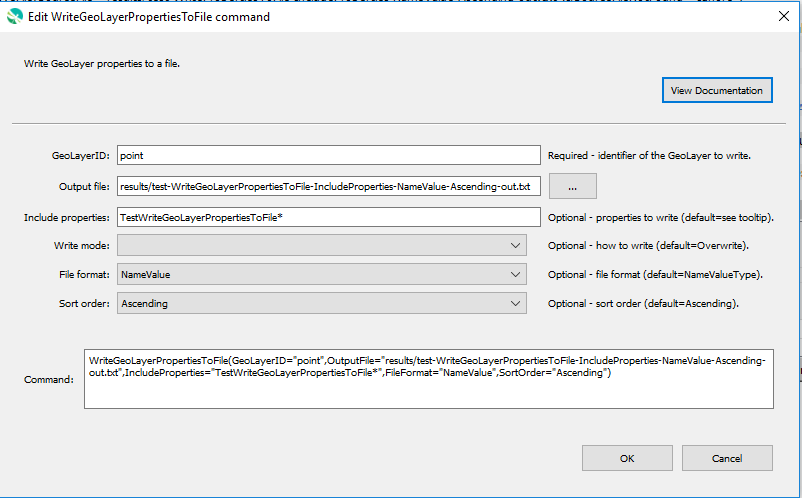

# GeoProcessor / Command / WriteGeoLayerPropertiesToFile #

* [Overview](#overview)
* [Command Editor](#command-editor)
* [Command Syntax](#command-syntax)
* [Examples](#examples)
* [Troubleshooting](#troubleshooting)
* [See Also](#see-also)

-------------------------

## Overview ##

The `WriteGeoLayerPropertiesToFile` command writes GeoLayer properties to a file.
Examples of using the command include:

* creating tests to verify that properties are being set
* passing information from the GeoProcessor to another program
* storing persistent information for later use, such as the date/time that data were last downloaded from a web service

A number of property formats are supported as listed in the following table.

**<p style="text-align: center;">
Property File Formats
</p>**

| **Format**&nbsp;&nbsp;&nbsp;&nbsp;&nbsp;&nbsp;&nbsp;&nbsp;&nbsp;&nbsp;&nbsp;&nbsp;&nbsp;&nbsp;&nbsp;&nbsp;&nbsp;&nbsp;&nbsp;&nbsp;&nbsp;&nbsp;&nbsp;&nbsp;&nbsp;&nbsp;&nbsp;&nbsp;&nbsp; | **Description** |
|-----------------------|-----------------|
| `NameValue`           | Simple format, all properties handled as text:<br><br>`PropertyName=PropertyValue`<br>`PropertyName="Property value, quoted if necessary"` |
| `NameTypeValue`       | Same as `NameValue` format, with non-primitive objects treated as simple constructors:<br><br>`PropertyName=PropertyValue`<br>`DateTimeProperty=DateTime("2010-10-01 12:30")`|
| `NameTypeValuePython` | Similar to the `NameTypeValue` format; however, objects are represented using “Pythonic” notation, to allow the file to be used directly by Python scripts:<br><br>`PropertyName="PropertyValue"`<br>`DateTimeProperty=DateTime(2010,10,1,12,30)` |

## Command Editor ##

The following dialog is used to edit the command and illustrates the command syntax.



**<p style="text-align: center;">
`WriteGeoLayerPropertiesToFile` Command Editor (<a href="../WriteGeoLayerPropertiesToFile.png">see full-size image</a>)
</p>**

## Command Syntax ##

The command syntax is as follows:

```text
WriteGeoLayerPropertiesToFile(Parameter="Value",...)
```
**<p style="text-align: center;">
Command Parameters
</p>**

| **Parameter**&nbsp;&nbsp;&nbsp;&nbsp;&nbsp;&nbsp;&nbsp;&nbsp;&nbsp;&nbsp;&nbsp;&nbsp;&nbsp;&nbsp;&nbsp;&nbsp;&nbsp;&nbsp;&nbsp;&nbsp;&nbsp;&nbsp;&nbsp;&nbsp;&nbsp;&nbsp; | **Description** | **Default**&nbsp;&nbsp;&nbsp;&nbsp;&nbsp;&nbsp;&nbsp;&nbsp;&nbsp;&nbsp; |
| --------------------|-----------------|----------------- |
| `GeoLayerID`        | The GeoLayer identifier, can use `${Property}`. | None - must be specified. |
| `OutputFile`        | The property file to write, as an absolute path or relative to the command file, can use `${Property}`. | None - must be specified. |
| `IncludeProperties` | The names of properties to write, separated by commas.  The `*` wildcard can be used to indicate multiple properties. | If not specified, all processor properties will be written. |
| `WriteMode`         | Indicates how the file should be written:<ul><li>`Append` – append the properties to the file without checking for matches (create the file if it does not exist).</li><li>`Overwrite` – overwrite the properties file.</ul> | `Overwrite` |

## Examples ##

See the [automated tests](https://github.com/OpenWaterFoundation/owf-app-geoprocessor-python-test/tree/master/test/commands/WriteGeoLayerPropertiesToFile).

## Troubleshooting ##

## See Also ##

* [SetGeoLayerProperty](../SetGeoLayerProperty/SetGeoLayerProperty.md) command
* [SetPropertyFromGeoLayer](../SetPropertyFromGeoLayer/SetPropertyFromGeoLayer.md) command
