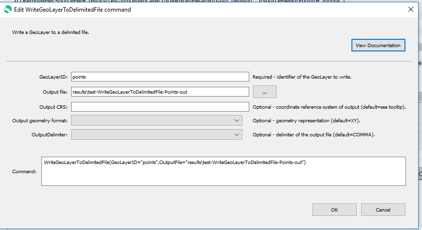

# GeoProcessor / Command / WriteGeoLayerToDelimitedFile #

* [Overview](#overview)
* [Command Editor](#command-editor)
* [Command Syntax](#command-syntax)
* [Examples](#examples)
* [Troubleshooting](#troubleshooting)
* [See Also](#see-also)

-------------------------

## Overview ##

The `WriteGeoLayerToDelimitedFile` command writes a
[GeoLayer](../../introduction/introduction.md#geolayer) to a [delimited file](https://en.wikipedia.org/wiki/Delimiter-separated_values).

* Each attribute of the GeoLayer is retained in a separate column of the output file. 
* The geometry of the GeoLayer is retained in one or more columns of the output file. 
* The coordinate reference system can be specified. 
* The geometry representation can be specified.
* The delimiter can be specified.

## Command Editor ##

The following dialog is used to edit the command and illustrates the command syntax.

**<p style="text-align: center;">

</p>**

**<p style="text-align: center;">
`WriteGeoLayerToDelimitedFile` Command Editor (<a href="../WriteGeoLayerToDelimitedFile.png">see full-size image</a>)
</p>**

## Command Syntax ##

The command syntax is as follows:

```text
WriteGeoLayerToDelimitedFile(Parameter="Value",...)
```
**<p style="text-align: center;">
Command Parameters
</p>**

|**Parameter**&nbsp;&nbsp;&nbsp;&nbsp;&nbsp;&nbsp;&nbsp;&nbsp;&nbsp;&nbsp;&nbsp;&nbsp;&nbsp;&nbsp;&nbsp;&nbsp;&nbsp;&nbsp;&nbsp;&nbsp;&nbsp;&nbsp;&nbsp;&nbsp;&nbsp;&nbsp;&nbsp;&nbsp; | **Description** | **Default**&nbsp;&nbsp;&nbsp;&nbsp;&nbsp;&nbsp;&nbsp;&nbsp;&nbsp;&nbsp; |
| --------------|-----------------|----------------- |
| `GeoLayerID` <br>**required**| The identifier of the GeoLayer to write.| None - must be specified. |
| `OutputFile` <br>**required**| The output delimited file (relative or absolute path). The file extension is not required. [`${Property}` syntax](../../introduction/introduction.md#geoprocessor-properties-property) is recognized. | None - must be specified. |
|`OutputCRS`|The [coordinate reference system](https://en.wikipedia.org/wiki/Spatial_reference_system) of the output delimited file. [EPSG or ESRI code format](http://spatialreference.org/ref/epsg/) required (e.g. [`EPSG:4326`](http://spatialreference.org/ref/epsg/4326/), [`EPSG:26913`](http://spatialreference.org/ref/epsg/nad83-utm-zone-13n/), [`ESRI:102003`](http://spatialreference.org/ref/esri/usa-contiguous-albers-equal-area-conic/)). <br><br>If the output CRS is different than the CRS of the GeoLayer, the geometries of the output delimited file are reprojected to the new CRS.|The GeoLayer's CRS.|  
|`OutputGeometryFormat`| The geometry representation, one of the following:<ul><li>`WKT` - The geometry is stored in one column in its [Well Known Text  (WKT)](https://en.wikipedia.org/wiki/Well-known_text) representation. <br>This type of geometry can represent 2D and 3D `POINTS`, `LINES` or `POLYGONS`.</li><li>`XY` - The geometry is stored in two columns as X and Y coordinates. <br>This type of geometry can only represent 2D `POINTS`. The `X` column is before the `Y` column.</li><li>`YX` - The geometry is stored in two columns as X and Y coordinates. <br>This type of geometry can only represent 2D `POINTS`. The `Y` column is before the `X` column.</li><li>`XYZ`: The geometry is stored in three columns as X, Y, and Z coordinates. <br>This type of geometry can only represent 3D `POINTS`.</li></ul>|`XY`|
|`OutputDelimiter`| The delimiter of the output delimited file. Must be one of the following options:<ul><li>`COMMA` - the comma (`,`)</li><li>`SEMICOLON` - the semicolon (`;`)</li><li>`TAB`: a tab character</li><li>`SPACE`: a space character</li></ul>|`COMMA`|

## Examples ##

See the [automated tests](https://github.com/OpenWaterFoundation/owf-app-geoprocessor-python-test/tree/master/test/commands/WriteGeoLayerToDelimitedFile).

The following GeoLayer data are used in the examples. 
The examples assume that the GeoLayers have already been read into the GeoProcessor from a file.

**<p style="text-align: left;">
Example GeoLayer Data
</p>**

|GeoLayerID|Coordinate Reference System (CRS)|Geometry Type|
| ---- | ----| ---|
| ExampleGeoLayer1  | EPGS:4326	(WGS84) |`POINTS`|
| ExampleGeoLayer2	| EPGS:4326	(WGS84) |`POLYGON`|

**<p style="text-align: left;">
ExampleGeoLayer1 Attribute Table
</p>**

|Id|Color|Landmark|
|---|---|---|
|1|Blue|River Crossing|
|2|Blue|Courthouse|
|3|Red|Farmhouse|
|4|Blue|Bakery|

**<p style="text-align: left;">
ExampleGeoLayer2 Attribute Table
</p>**

|Id|LakeName|AreaAcre|
|---|---|---|
|1|Arlington|1939|

### Example 1: Write a GeoLayer to a Delimited File ###

```
WriteGeoLayerToDelimitedFile(GeoLayerID = "ExampleGeoLayer1", OutputFile = "ExampleOutputFolder/ExampleFile1_comma")
WriteGeoLayerToDelimitedFile(GeoLayerID = "ExampleGeoLayer1", OutputFile = "ExampleOutputFolder/ExampleFile1_semicolon", OutputDelimiter = "SEMICOLON")
```

After running the commands the following delimited files are written to the `ExampleOutputFolder` folder. 

**<p style="text-align: left;">
ExampleOutputFolder
</p>**

|Filename|CRS|Delimiter|
|------|---|---|
|ExampleFile1_comma.csv|EPSG:4326 (WGS84)|`,`|
|ExampleFile1_semicolon.csv|EPSG:4326 (WGS84)|`;`|

---
**ExampleFile1_comma.csv File Content**

```
X, Y, Id, Color, Landmark
-106.277078683373, 39.3223878229657, Blue, River Crossing
-105.656271282221, 39.2606598143284, Blue, Courthouse
-105.672144198728, 38.7932906060751, Red, Farmhouse
-105.300012489515, 39.1954044909119, Blue, Bakery
```
---

### Example 2: Write a Polygon GeoLayer to a Delimited File ###

```
WriteGeoLayerToDelimitedFile(GeoLayerID = "ExampleGeoLayer2", OutputFile = "ExampleOutputFolder/ExampleFile2", OutputGeometry="WKT")
```

---
**ExampleFile2.csv File Content**

```
WKT, LakeName, AreaAcre
"POLYGON ((-1.54922894424674 0.143534994068802,-1.06287069988138 0.297746144721234,-0.99644128113879 -0.176749703440095,-1.41874258600237 -0.271648873072361,-1.41874258600237 -0.271648873072361,-1.54922894424674 0.143534994068802))", Arlington, 1939

```

## Troubleshooting ##

## See Also ##

* The GeoLayer is written using the [`QGIS QgsVectorFileWriter Class`](https://qgis.org/api/classQgsVectorFileWriter.html).
  See [documentation](https://docs.qgis.org/2.14/en/docs/pyqgis_developer_cookbook/vector.html#writing-vector-layers)
  for examples on utilizing the `QGSVectorFileWriter` class in the PyQGIS environment.
* [`ReadGeoLayerFromDelimitedFile`](../ReadGeoLayerFromDelimitedFile/ReadGeoLayerFromDelimitedFile.md)
