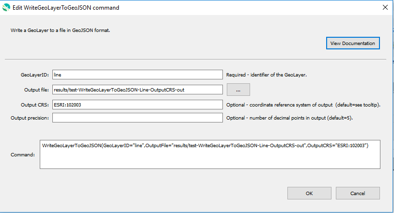

# GeoProcessor / Command / WriteGeoLayerToGeoJSON #

*   [Overview](#overview)
*   [Command Editor](#command-editor)
*   [Command Syntax](#command-syntax)
*   [Examples](#examples)
*   [Troubleshooting](#troubleshooting)
*   [See Also](#see-also)

-------------------------

## Overview ##

The `WriteGeoLayerToGeoJSON` command writes a [GeoLayer](../../introduction/introduction.md#geolayer)
to a file in [GeoJSON format](../../spatial-data-format-ref/GeoJSON/GeoJSON.md),
using [RFC 7946 specification](https://tools.ietf.org/html/rfc7946).
The default format is minimalistic and is used with GeoProcessor automated tests.

*   The attributes of the GeoLayer are output as properties
*   The coordinate reference system defaults to `EPSG:4326` (WGS84)
*   The coordinate maximum precision can be specified (extra zeros will be omitted)

In the future additional parameters will be added to further control output.

## Command Editor ##

The following dialog is used to edit the command and illustrates the command syntax.

**<p style="text-align: center;">

</p>**

**<p style="text-align: center;">
`WriteGeoLayerToGeoJSON` Command Editor (<a href="../WriteGeoLayerToGeoJSON.png">see full-size image</a>)
</p>**

## Command Syntax ##

The command syntax is as follows:

```text
WriteGeoLayerToGeoJSON(Parameter="Value",...)
```
**<p style="text-align: center;">
Command Parameters
</p>**

|**Parameter**&nbsp;&nbsp;&nbsp;&nbsp;&nbsp;&nbsp;&nbsp;&nbsp;&nbsp;&nbsp;&nbsp;&nbsp;&nbsp;&nbsp;&nbsp;&nbsp;&nbsp;&nbsp;&nbsp;&nbsp;&nbsp; | **Description** | **Default**&nbsp;&nbsp;&nbsp;&nbsp;&nbsp;&nbsp;&nbsp;&nbsp;&nbsp;&nbsp; |
| --------------|-----------------|----------------- |
| `GeoLayerID` <br>**required**| The identifier of the GeoLayer to write. [`${Property}` syntax](../../introduction/introduction.md#geoprocessor-properties-property) is recognized.| None - must be specified. |
| `OutputFile` <br>**required**| The output GeoJSON file (relative or absolute path). [`${Property}` syntax](../../introduction/introduction.md#geoprocessor-properties-property) is recognized. | None - must be specified. |
| `OutputCRS` | The [coordinate reference system](https://en.wikipedia.org/wiki/Spatial_reference_system) of the output GeoJSON. | **Always defaults to `EPSG:4326` (WGS84) as per GeoJSON RFC-7946 specification.** |
| `OutputPrecision` | The maximum number of decimal points to include in the output GeoJSON file's coordinates. Must be a positive integer between 0 and 15. <br><br> The precision of coordinate values can greatly impact the size of the file and precision of drawing the features. For example, a higher `OutputPrecision` value increases the output GeoJSON file size and increases the geometry's precision.  For further explanation, refer to the *Precision* section of the [Decimal degrees Wikipedia page](https://en.wikipedia.org/wiki/Decimal_degrees). | 5 |

## Examples ##

See the [automated tests](https://github.com/OpenWaterFoundation/owf-app-geoprocessor-python-test/tree/main/test/commands/WriteGeoLayerToGeoJSON).

The following GeoLayer data are used in the examples. 
The examples assume that the `ExampleGeoLayer1` and `ExampleGeoLayer2` GeoLayers have already been
read into the GeoProcessor with the [`ReadGeoLayerFromGeoJSON`](../ReadGeoLayerFromGeoJSON/ReadGeoLayerFromGeoJSON.md) command.

**<p style="text-align: left;">
Example GeoLayer Data
</p>**

|GeoLayerID|Coordinate Reference System (CRS)|
| ---- | ----|
| ExampleGeoLayer1 | EPSG:4326 (WGS84) |
| ExampleGeoLayer2 | EPSG:26913 (NAD83 UTM Zone 13N) |

### Example 1: Write a GeoLayer to a GeoJSON File ###

```
WriteGeoLayerToGeoJSON(GeoLayerID="ExampleGeoLayer1",OutputFile="ExampleOutputFolder/ExampleFile1")
WriteGeoLayerToGeoJSON(GeoLayerID="ExampleGeoLayer2",OutputFile="ExampleOutputFolder/ExampleFile2")
```
After running the commands, the following GeoJSON files are written to the `ExampleOutputFolder` folder. 

**<p style="text-align: left;">
ExampleOutputFolder
</p>**

|Filename|File Type|CRS|Coordinate Precision|
|------|---|---|---|
|ExampleFile1.geojson|GeoJSON|EPSG:4326 (WGS84)|5|
|ExampleFile2.geojson|GeoJSON|EPSG:26913 (NAD83 UTM Zone 13N)|5|

**ExampleFile1_01.geojson File Content**

```
{
  "type":"FeatureCollection",
  "features":[
    {
      "type": "Feature",
      "properties": {
        "id":1
      },
      "geometry": {
        "type": "Point",
        "coordinates": [
          -1.3,
          0.5
         ]
       }
     }
  ]
}
```

---
**ExampleFile1_05.geojson File Content**

```
{
  "type":"FeatureCollection",
  "features": [
    {
      "type": "Feature",
      "properties": {
        "id":1
      },
      "geometry": {
        "type": "Point",
        "coordinates": [
          -1.33333,
          0.52194
        ]
      }
    }
  ]
}
```

## Troubleshooting ##

## See Also ##

*   The GeoLayer is written using the [GDAL GeoJSON driver](https://gdal.org/drivers/vector/geojson.html)
*   [`ReadGeoLayerFromGeoJSON`](../ReadGeoLayerFromGeoJSON/ReadGeoLayerFromGeoJSON.md) command
