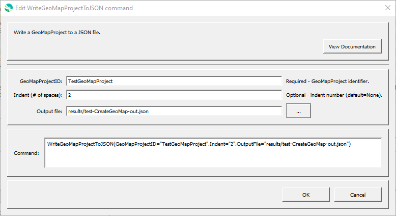

# GeoProcessor / Command / WriteGeoMapProjectToJSON #

*   [Overview](#overview)
*   [Command Editor](#command-editor)
*   [Command Syntax](#command-syntax)
*   [Examples](#examples)
*   [Troubleshooting](#troubleshooting)
*   [See Also](#see-also)

-------------------------

## Overview ##

The `WriteGeoMapProjectToJSON` writes an in-memory GeoMapProject to a JSON file,
which can be used as input to web mapping application or other software.

*   See the [CreateGeoMap](../CreateGeoMap/CreateGeoMap.md) command documentation for guidance on creating maps
*   See the [GeoMapProject](../../appendix-geomapproject/geomapproject.md) documentation for background and file format specification.

The output `sourcePath` for each GeoLayer is determined as follows:

1.  If the GeoLayer was written, then the output location is used.
2.  If the GeoLayer was not written, then the input location is used if not `MEMORY`.
    Therefore, layers that were created in memory must be written in order for the path to be known in the map configuration file.

## Command Editor ##

The following dialog is used to edit the command and illustrates the command syntax.

**<p style="text-align: center;">

</p>**

**<p style="text-align: center;">
`WriteGeoMapProjectToJSON` Command Editor (<a href="../WriteGeoMapProjectToJSON.png">see full-size image</a>)
</p>**

## Command Syntax ##

The command syntax is as follows:

```text
WriteGeoMapProjectToJSON(Parameter="Value",...)
```
**<p style="text-align: center;">
Command Parameters
</p>**

| **Parameter**&nbsp;&nbsp;&nbsp;&nbsp;&nbsp;&nbsp;&nbsp;&nbsp;&nbsp;&nbsp;&nbsp;&nbsp;&nbsp;&nbsp;&nbsp;&nbsp;&nbsp;&nbsp;&nbsp;&nbsp;&nbsp;&nbsp;&nbsp;&nbsp;&nbsp;&nbsp;&nbsp;&nbsp;&nbsp;&nbsp;&nbsp;&nbsp; | **Description** | **Default**&nbsp;&nbsp;&nbsp;&nbsp;&nbsp;&nbsp;&nbsp;&nbsp;&nbsp;&nbsp;&nbsp;&nbsp;&nbsp;&nbsp;&nbsp;&nbsp;&nbsp;&nbsp; |
| --------------|-----------------|----------------- |
| `GeoMapProjectID`<br>**required** | The ID of the GeoMapProject to write. | None - must be specified. |
| `Indent` | The number of spaces to use for JSON "pretty printing".  | No indenting. |
| `OutputFile`<br>**required** | The name of the output file to write, typically relative to the command file's folder. | None - must be specified. |

## Examples ##

See the [automated tests](https://github.com/OpenWaterFoundation/owf-app-geoprocessor-python-test/tree/main/test/commands/CreateGeoMapProject).

## Troubleshooting ##

## See Also ##

*   [`AddGeoLayerViewToGeoMap`](../AddGeoLayerViewToGeoMap/AddGeoLayerViewToGeoMap.md) command
*   [`AddGeoLayerViewGroupToGeoMap`](../AddGeoLayerViewGroupToGeoMap/AddGeoLayerViewGroupToGeoMap.md) command
*   [`AddGeoMapToGeoMapProject`](../AddGeoMapToGeoMapProject/AddGeoMapToGeoMapProject.md) command
*   [`CreateGeoMap`](../CreateGeoMap/CreateGeoMap.md) command
*   [`CreateGeoMapProject`](../CreateGeoMapProject/CreateGeoMapProject.md) command
*   [`SetGeoLayerViewCategorizedSymbol`](../SetGeoLayerViewCategorizedSymbol/SetGeoLayerViewCategorizedSymbol.md) command
*   [`SetGeoLayerViewGraduatedSymbol`](../SetGeoLayerViewGraduatedSymbol/SetGeoLayerViewGraduatedSymbol.md) command
*   [`SetGeoLayerViewSingleSymbol`](../SetGeoLayerViewSingleSymbol/SetGeoLayerViewSingleSymbol.md) command
