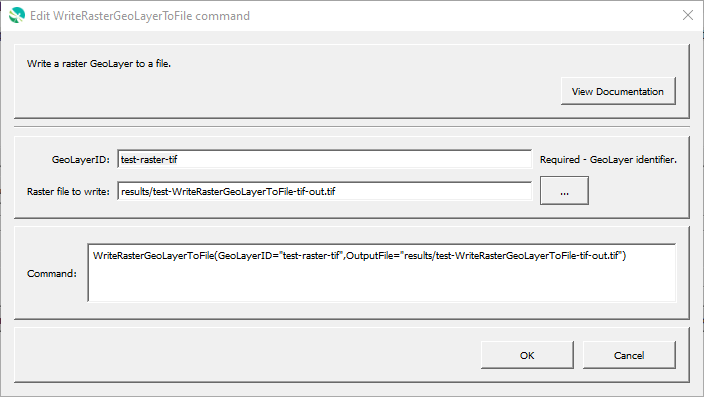

# GeoProcessor / Command / WriteRasterGeoLayerFromFile #

*   [Overview](#overview)
*   [Command Editor](#command-editor)
*   [Command Syntax](#command-syntax)
*   [Examples](#examples)
*   [Troubleshooting](#troubleshooting)
*   [See Also](#see-also)

-------------------------

## Overview ##

The `WriteRasterGeoLayerToFile` command writes a raster [GeoLayer](../../introduction/introduction.md#geolayer)
to a raster file.
The file extension indicates the file format, for example `tif` for GeoTiff.
Handling other than defaults for each file are described below:

**<p style="text-align: center;">
Details of File Format Handling
</p>**

| **Format** | **Details** |
| -- | -- |
| `GTiff` | Files are written to ensure that files are optimized for web use, including being compressed and using tiles (see [Cloud optimized GeoTIFF](https://trac.osgeo.org/gdal/wiki/CloudOptimizedGeoTIFF)). |

## Command Editor ##

The following dialog is used to edit the command and illustrates the command syntax.

**<p style="text-align: center;">

</p>**

**<p style="text-align: center;">
`WriteRasterGeoLayerToFile` Command Editor (<a href="../WriteRasterGeoLayerToFile.png">see full-size image</a>)
</p>**

## Command Syntax ##

The command syntax is as follows:

```text
WriteRasterGeoLayerToFile(Parameter="Value",...)
```
**<p style="text-align: center;">
Command Parameters
</p>**

|**Parameter**&nbsp;&nbsp;&nbsp;&nbsp;&nbsp;&nbsp;&nbsp;&nbsp;&nbsp;&nbsp;&nbsp;&nbsp;&nbsp;&nbsp;&nbsp;&nbsp;&nbsp;&nbsp;&nbsp;&nbsp;&nbsp; | **Description** | **Default**&nbsp;&nbsp;&nbsp;&nbsp;&nbsp;&nbsp;&nbsp;&nbsp;&nbsp;&nbsp; |
| --------------|-----------------|----------------- |
| `GeoLayerID` <br>**required**| The identifier of the GeoLayer to write. [`${Property}` syntax](../../introduction/introduction.md#geoprocessor-properties-property) is recognized.| None - must be specified. |
| `OutputFile` <br>**required**| The output GeoJSON file (relative or absolute path). [`${Property}` syntax](../../introduction/introduction.md#geoprocessor-properties-property) is recognized. | None - must be specified. |
| `OutputCRS` | The [coordinate reference system](https://en.wikipedia.org/wiki/Spatial_reference_system) of the output file. [EPSG or ESRI code format](http://spatialreference.org/ref/epsg/) required (e.g. [`EPSG:4326`](http://spatialreference.org/ref/epsg/4326/), [`EPSG:26913`](http://spatialreference.org/ref/epsg/nad83-utm-zone-13n/), [`ESRI:102003`](http://spatialreference.org/ref/esri/usa-contiguous-albers-equal-area-conic/)). | CRS of the GeoLayer. |

## Examples ##

See the [automated tests](https://github.com/OpenWaterFoundation/owf-app-geoprocessor-python-test/tree/main/test/commands/WriteRasterGeoLayerToFile).

## Troubleshooting ##

## See Also ##

*   This command uses the QGIS [`gdal:translate`](https://docs.qgis.org/latest/en/docs/user_manual/processing_algs/gdal/rasterconversion.html#translate-convert-format) processing algorithm
*   [`ReadRasterGeoLayerFromFile`](../ReadRasterGeoLayerFromFile/ReadRasterGeoLayerFromFile.md) command
