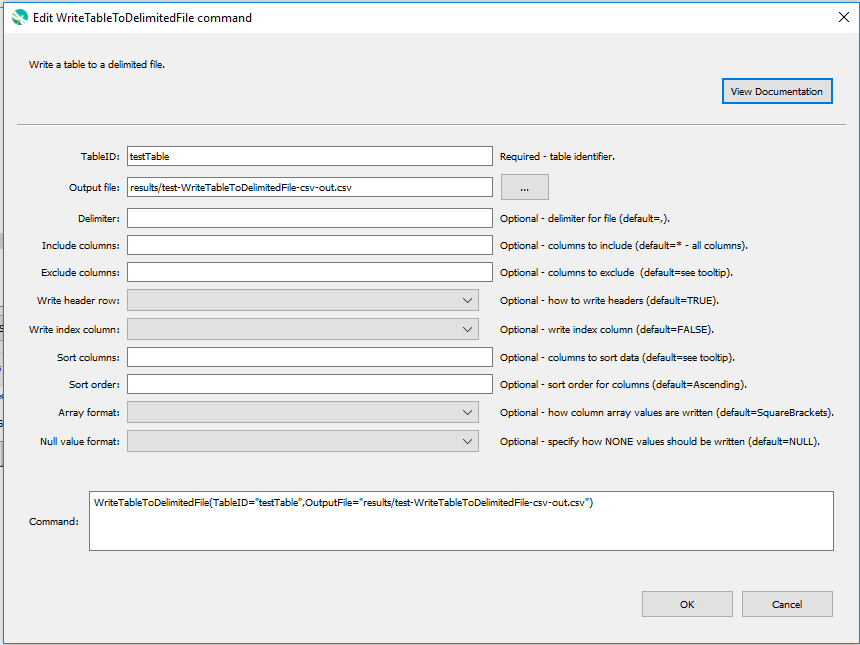

# GeoProcessor / Command / WriteTableToDelimitedFile #

* [Overview](#overview)
* [Command Editor](#command-editor)
* [Command Syntax](#command-syntax)
* [Examples](#examples)
* [Troubleshooting](#troubleshooting)
* [See Also](#see-also)

-------------------------

## Overview ##

The `WriteTableToDelimitedFile` command writes a [Table](../../introduction/introduction.md#table)
to a [delimited file](https://en.wikipedia.org/wiki/Delimiter-separated_values).

* Can specify the delimiter. See the `Delimiter` parameter. 
* Can specify which Table columns to write to the delimited file. See the `IncludeColumns` and the `ExcludeColumns` parameters.
* Can specify to include or exclude the Table's header row. See the `WriteHeaderRow` parameter. 
* Can specify to include or exclude the Table's index column. See the `WriteIndexColumn` parameter.
* Can sort the Table's records. See the `SortingColumn` and `SortingOrder` parameter. 

## Command Editor ##

The following dialog is used to edit the command and illustrates the command syntax.

**<p style="text-align: center;">

</p>**

**<p style="text-align: center;">
`WriteTableToDelimitedFile` Command Editor (<a href="../WriteTableToDelimitedFile.png">see full-size image</a>)
</p>**

## Command Syntax ##

The command syntax is as follows:

```text
WriteTableToDelimitedFile(Parameter="Value",...)
```
**<p style="text-align: center;">
Command Parameters
</p>**

|**Parameter**&nbsp;&nbsp;&nbsp;&nbsp;&nbsp;&nbsp;&nbsp;&nbsp;&nbsp;&nbsp;&nbsp;&nbsp;&nbsp;&nbsp;&nbsp;&nbsp;&nbsp;&nbsp;&nbsp;&nbsp;&nbsp;&nbsp;&nbsp;&nbsp;&nbsp;&nbsp;&nbsp;&nbsp; | **Description** | **Default**&nbsp;&nbsp;&nbsp;&nbsp;&nbsp;&nbsp;&nbsp;&nbsp;&nbsp;&nbsp; |
| --------------|-----------------|----------------- |
|`TableID` <br>**required**| The identifier of the Table to write.| None - must be specified. |
|`OutputFile` <br>**required**| The output delimited file (relative or absolute path). [`${Property}` syntax](../../introduction/introduction.md#geoprocessor-properties-property) is recognized. | None - must be specified. |
|`Delimiter` | The delimiter of the output delimited file. Must be a single character. |`,`|
|`IncludeColumns` | A comma-separated list of the [glob-style patterns](https://en.wikipedia.org/wiki/Glob_(programming)) filtering which columns to include in the delimited file. <br><br> See [Determining Which Columns to Write](#determining-which-columns-to-write).| `*` <br><br> All columns are written. |  
|`ExcludeColumns` | A comma-separated list of the [glob-style patterns](https://en.wikipedia.org/wiki/Glob_(programming)) filtering which columns to exclude in the delimited file. <br><br> See [Determining Which Columns to Write](#determining-which-columns-to-write).| No columns are excluded.|
|`WriteHeaderRow` | Indicate whether header row should be written:<ul><li>`True` - the Table's header row is included in the output delimited file</li><li>`False` - the Table's header row is not included in the output delimited file</li></ul>|`True`|
|`WriteIndexColumn` | Indicate whether an index column should be written:<ul><li>`True` - the Table's index column is included in the output delimited file. The index column header is an empty string.</li><li>`False` - the Table's index column is not included in the output delimited file.</li></ul>|`False`|
|`SortColumns` | The names of the Table columns, separated by columns, used to sort the order that the table records are written to the delimited file|The first Table column.|
|`SortOrder` |The sort order for columns specified by `SortColumns`, using the syntax: `SortColumn1:Ascending,SortColumn2:Descending`. As indicated in the above example, the sort order must be specified as one of the following: `Ascending` or `Descending`.|`Ascending`|
|`ArrayFormat` | Indicate how arrays should be writtne:<ul><li>`SquareBrackets` - table column array values are written as a string with square brackets and comma delimiter (`[val1,val2,val3]`).</li><li>If `CurlyBrackets` - table column array values are written as a string with curly brackets and comma delimiber (`{val1,val2,val3}`).</li></ul>|`SquareBrackets`|
|`NullValueFormat` | Indicate how to write null values:<ul><li>`NULL` - `None` items in table column array values are written as `NULL` (e.g. `"[NULL, 4, NULL]"`</li><li>`None` - `None` items in table column array values are written as `None` (e.g.,`"[None, 4, None]"`</li></ul>|`NULL`|

### Determining Which Columns to Write

* The `IncludeColumns` parameter is always processed first. The `ExcludeColumns` parameter is always processed second. 
	* The `IncludeColumns` selects all of the Table's columns that follow the given patterns. By default (`*`) all of the Table's columns are included. 
	* The `ExcludeColumns` removes all of the columns previously selected from the `IncludeColumns` parameter that follow the given patterns. 

## Examples ##

See the [automated tests](https://github.com/OpenWaterFoundation/owf-app-geoprocessor-python-test/tree/master/test/commands/WriteTableToDelimitedFile).

## Troubleshooting ##

## See Also ##

- [`ReadTableFromDelimitedFile`](../ReadTableFromDelimitedFile/ReadTableFromDelimitedFile.md) command
