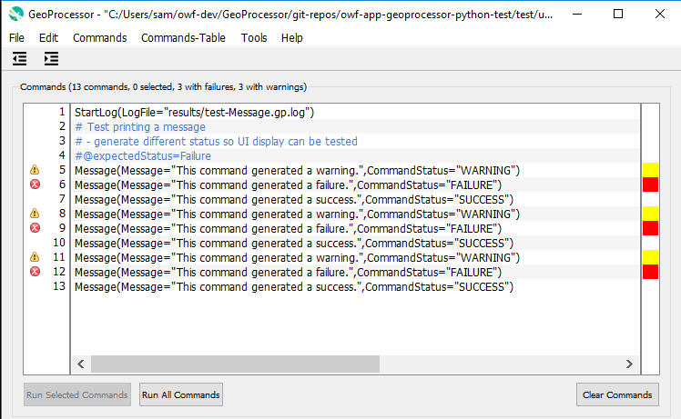

# GeoProcessor / Getting Started #

This page explains how to get started using the GeoProcessor.

*   If not already installed, install the GeoProcessor software as per the [Install GeoProcessor](../appendix-install/install.md) documentation.
*   See also the section on [Running the GeoProcessor](../running/overview.md) for how to start the software,
    in particular [running the user interface (UI)](../running/ui.md).

The following are basic tasks to use the GeoProcessor:

*   [Conceptualize a Workflow](#conceptualize-a-workflow)
*   [Create a Command Workflow](#create-a-command-workflow)
    +   [Best Practices for Command Files](#best-practices-for-command-files)
*   [Run the Command Workflow using the GeoProcessor](#run-the-command-workflow-using-the-geoprocessor)
*   [View Results](#view-results)
*   [Refine the Command Workflow](#refine-the-command-workflow)

---------------

## Conceptualize a Workflow ##

The GeoProcessor is fundamentally a tool for automating spatial data processing workflows.
Therefore, to define a workflow, it is necessary to first define what work is to be done.
It is best to conceptualize the workflow without thinking about software features
and break the workflow into logical tasks.
This allows the tasks and their input to be improved as the workflow is refined.
Once the basic workflow is defined, software features will become more important.
For example, the following workflow describes a common task:

1.  Read in a GeoLayer from a shapefile.
2.  Define a region for clipping (for example, state boundary extent).
3.  Clip the layer to the region.
4.  Write the clipped GeoLayer to a new format, for example GeoJSON, for use in a web application.

A workflow can be conceptualized before using the GeoProcessor software, such as creating some form of document or diagram.
Alternatively, the GeoProcessor user interface (UI) can be used to interactively prototype a workflow,
such as by adding placeholder comments and commands to perform basic tasks such as reading and writing data,
and then filling in the logic blanks, as described in the next section.

## Create a Command Workflow ##

Once the conceptual workflow has been determined, corresponding GeoProcessor
commands can be used to do the work by creating a "command file" that can be run by the GeoProcessor.
Refer to the [Command Reference](../command-ref/overview.md) to learn which commands to use for specific work tasks.
Commands are grouped in menus in the GeoProcessor UI.
For example, the following commands are suitable to perform the above conceptual work tasks:

1.  [ReadGeoLayerFromShapefile](../command-ref/ReadGeoLayerFromShapefile/ReadGeoLayerFromShapefile.md) - reads the layer to be processed
2.  [CreateGeoLayerFromGeometry](../command-ref/CreateGeoLayerFromGeometry/CreateGeoLayerFromGeometry.md) - creates a temporary layer as the clipping extent
3.  [ClipGeoLayer](../command-ref/ClipGeoLayer/ClipGeoLayer.md) - clip the first layer using the clipping extent layer
4.  [WriteGeoLayerToGeoJSON](../command-ref/WriteGeoLayerToGeoJSON/WriteGeoLayerToGeoJSON.md) - write the result to a GeoJSON file

The GeoProcessor will continue to be enhanced to add new commands as necessary.
The goal is to provide enough commands to perform common tasks, either by themselves or in conjunction with other commands.

Although the command file can be created with a text editor, with contents similar to those shown below,
using the user interface helps guide creation of commands by providing data entry tools and data checks.
The following workflow is a simplified version of a
[GeoProcessor test](https://github.com/OpenWaterFoundation/owf-app-geoprocessor-python-test/blob/master/test/commands/ClipGeoLayer/test-ClipGeoLayer-linesAsInput.gp).

```
# Read the lines geojson (input GeoLayer) and the polygon geojson (clipping GeoLayer)
ReadGeoLayerFromGeoJSON(InputFile="data/input_lines.geojson")
ReadGeoLayerFromGeoJSON(InputFile="data/clipping_polygon.geojson")
# Clip the lines GeoLayerID by the clippling polygon 
ClipGeoLayer(InputGeoLayerID="input_lines",ClippingGeoLayerID="clipping_polygon")
WriteGeoLayerToGeoJSON(GeoLayerID="input_lines_clippedBy_clipping_polygon",OutputFile="results/test-ClipGeoLayer-linesAsInput-out.geojson")
```

### Best Practices for Command Files ###

See the section on [Best Practices / Command Files](../best-practices/command-files.md).

## Run the Command Workflow Using the GeoProcessor ##

See the [Running the GeoProcessor Overview](../running/overview.md) section for information about running the GeoProcessor.
The UI is typically run when creating a workflow (see the [Running UI](../running/ui.md) section of the documentation).
A command file that is read using ***File / Open / Command File...*** or commands that are added to the ***Commands***
area of the UI can be run using the ***Run Selected Commands*** and ***Run All Commands*** buttons at the bottom
of the ***Commands*** area.

After successfully running a command workflow, the output files should have been created.
Errors will be indicated as follows:

*   in the user interface as warning and error icons next to commands - mouse over the indicator on the left
    to see a summary of the issues or left-click on a command in the command list and use the 



*   in the command shell window if run in batch mode - use the scrollbar to review warning messages
*   the log file created by the [`StartLog`](../command-ref/StartLog/StartLog.md) command, if the command is used
*   the startup log file found in the `.owf-gp/1/logs` folder in the user's files (or similar, where `1` is the GeoProcessor major version)
    +   `C:\Users\user\.owf-gp\1\logs` on Windows (or similar)
    +   `/home/user/.owf-gp/1/logs` on Linux (or similar)
    +   `/cygdrive/C/Users/user/.owf-gp/1/logs` on Cygdri (or similar)ve
    +   this file is closed when the [`StartLog`](../command-ref/StartLog/StartLog.md) command is run
*   use the ***Tools / View Log File*** and ***Tools / View Startup Log File*** menus to view log files.

See also the [Troubleshooting](../troubleshooting/troubleshooting.md) section of the documentation.

## View Results ##

The results from running the commands can be viewed in various ways depending on the goals of the workflow,
for example:

1.  **Spatial data layers focus** - if the focus of the workflow is to create spatial data layers,
    then it may be most effective to view the layers in the ***Results / GeoLayers*** tab.
    For example, right-click on a layer and view as a map or attribute table.
2.  **Output product focus** - if the focus of the workflow is to create an output product that
    may require more effort to view, such as a complex map or mapping tool, other software may need to be used.
    For example, the spatial data files created by the workflow may be viewed in a web application or other software.
3.  **Testing focus** - if the focus of the workflow is testing, then important results are the warning and failure indicators
    for [`CompareFiles`](../command-ref/CompareFiles/CompareFiles.md)
    and the test summary output from commands like
    [`StartRegressionTestResultsReport`](../command-ref/StartRegressionTestResultsReport/StartRegressionTestResultsReport.md)
    (output files are listed in the ***Results / Output Files*** tab).

An appropriate combination of GeoProcessor features and other software tools should be used to view results to
ensure that the workflow is correct and that results are useful.

## Refine the Command Workflow ##

Once a command workflow has been created, it can be refined to add additional functionality and error-handling.
For example, use the [`If`](../command-ref/If/If.md) command to check for issues and use the
[`Message`](../command-ref/Message/Message.md) and check commands to generate warnings.
