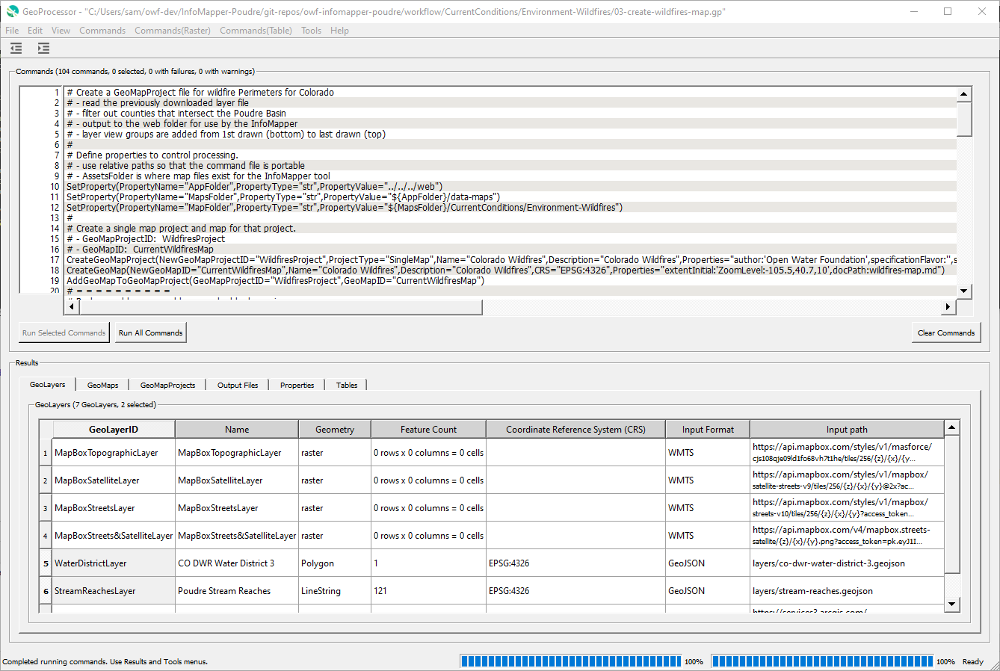

# GeoProcessor #

This is the user documentation for the Open Water Foundation (OWF) GeoProcessor software.

* [Introduction](#introduction)
* [About the Open Water Foundation](#about-the-open-water-foundation)
* [How to Use this Documentation](#how-to-use-this-documentation)
* [Downloads](#downloads)
* [License](#license)
* [Source Repository on GitHub](#source-repository-on-github)

---------------

## Introduction ##

The GeoProcessor software provides features that:

* automate spatial data processing using a workflow command language with simple syntax
* edit and run workflows, and display results
* provide error handling and feedback
* read, process, and write spatial data layers for various sources and formats
* read, process, and write data tables for various formats
* automate creation of map configurations, for use in other tools such as web applications
* provide an integrated testing framework to validate the GeoProcessor software and workflows

The GeoProcessor is similar in design to the
[TSTool (Time Series Tool)](http://opencdss.state.co.us/opencdss/tstool/) software
that OWF has developed for the State of Colorado.

The following image illustrates the main interface for editing and running workflows,
and visualizing results.

**

**

**

GeoProcessor Main Window (<a href="../images/GeoProcessor-main.png">see full-size image</a>)

**

The GeoProcessor software is installed in parallel with the following
geographic information system (GIS) software frameworks,
which provide spatial data processing functionality via Python libraries:

* free and open source [QGIS](https://qgis.org/en/site/) - **standalone QGIS the primary version for development**
* commercial [ArcGIS Pro](https://pro.arcgis.com/en/pro-app/) - **ArcGIS Pro version has been prototyped**

The GeoProcessor is particularly useful when workflows need to be standardized as part
of a business process or analysis effort.
The workflows can be shared with team members working in different
organizations, different operating systems, and different GIS environments.
The GeoProcessor is also useful for completing one-off tasks, prototyping workflows,
and checking other software tools and processes.
Workflow "command files" can be managed in a version control system such as Git/GitHub to ensure
that changes to workflows are tracked.

Additional GeoProcessor product information can be found in the [Introduction](introduction/introduction.md).

## About the Open Water Foundation ##

The [Open Water Foundation](http://openwaterfoundation.org) is a nonprofit social enterprise that focuses
on developing and supporting open source software for water resources, so that organizations can make better decisions about water.
OWF also works to advance open data tools and implementation.

See also the [Open Water Foundation website](http://openwaterfoundation.org) website.

## How to Use this Documentation ##

The documentation is organized in order of information and tasks necessary to install and use the GeoProcessor software.
References are provided for GeoProcessor commands and spatial data formats that are supported by the software.

This documentation is not intended to be a full reference for GIS concepts technologies.
The documentation serves as a reference for GeoProcessor features, explains relevant concepts,
and provides examples to get started.
See the [Resources section](resources/resources.md) for additional information from other sources.

Use the navigation menu provided on the left side of the page to navigate the documentation sections within the full document.
Use the navigation menu provided on the right side of the page to navigate the documentation sections with a page.
The navigation menus may not be displayed if the web browser window is narrow or if viewing on a mobile device,
in which case look for a menu icon to access the menus.
Use the search feature to find documentation matching the search words.

See also:

* [Open Water Foundation / Learn website](http://learn.openwaterfoundation.org)
* [Open Water Foundation / Learn QGIS](http://learn.openwaterfoundation.org/owf-learn-qgis/)

## Downloads ##

The GeoProcessor software can be downloaded from:

* [GeoProcessor download page](http://software.openwaterfoundation.org/geoprocessor/)
* See also the [Open Water Foundation / sotftware](http://software.openwaterfoundation.org/)

## License ##

The GeoProcessor sofware is licensed using GPL v3.

The OWF GeoProcessor documentation is licensed under the
[Creative Commons Attribution-NonCommercial-ShareAlike 4.0 International License](https://creativecommons.org/licenses/by-nc-sa/4.0).

## Source Repository on GitHub ##

The source files for this documentation are maintained in a GitHub repository:
[owf-app-geoprocessor-python-doc-user](https://github.com/OpenWaterFoundation/owf-app-geoprocessor-python-doc-user).
