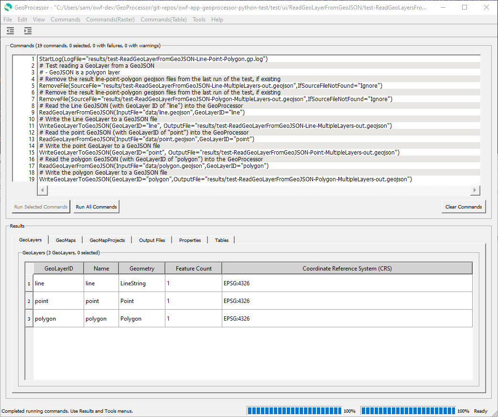

# GeoProcessor / Introduction #

This section of the documentation provides background information about the GeoProcessor and
concepts that are used throughout the documentation.
See the [Getting Started](../getting-started/getting-started.md) section for information
about using the software.

*   [Need for the GeoProcessor](#need-for-the-geoprocessor)
*   [User Interface Overview](#user-interface-overview)
*   [Concepts](#concepts)
    +   [GeoProcessor Commands and Workflows](#geoprocessor-commands-and-workflows)
    +   [GeoProcessor Properties - `${Property}`](#geoprocessor-properties-property)
    +   [Spatial Data Sources and Formats](#spatial-data-sources-and-formats)
    +   [GeoLayer](#geolayer)
    +   [GeoMap](#geomap)
    +   [GeoMapProject](#geomapproject)
    +   [Table](#table)
    +   [DataStore](#datastore)
*   [Alternatives to the GeoProcessor](#alternatives-to-the-geoprocessor)
*   [Next Steps](#next-steps)

--------------

## Need for the GeoProcessor ##

The GeoProcessor has been created to meet needs related to geospatial data processing and
software and process validation.

*   There is often a need to automate processing of spatial data, ranging from simple to complex tasks.
    Existing tools can be complex to understand and may not provide needed functionality.

*   There is a need to support "programming" without having to learn a programming language.
    The GeoProcessor allows people to program a workflow using pre-built commands that do not
    require programming Python or another language.
    The GeoProcessor workflow uses "programming by convention" that relies on using
    unique identifiers for data objects, and common processing commands.

*   There is often a need to share and version control workflows.
    GeoProcessor workflows are simple text files that can be shared, for example by email or zip file.
    Because workflows are text files, they can also be version-controlled in software such as Git,
    and can be easily viewed on GitHub or other version control cloud platforms.

*   There is a need to easily scale processing.
    The GeoProcessor is designed to handle large datasets and workflows,
    with features to evaluate and troubleshoot performance.
    Often, a workflow can be processed on a limited dataset and can then be scaled to process large datasets.
    For example, the GeoProcessor can read controlling data from tables and repeat the same
    analysis steps for each item in a table.

*   The cost of commercial software may be a barrier to adopting geographic information system (GIS) tools,
    in particular for organizations that use the software on a limited basis.
    The GeoProcessor is intended as a production tool for those who use free open source QGIS software.
    OWF is also developing an ArcGIS Pro version of the GeoProcessor for organizations that have invested in Esri software.

*   There is a need for tools that can automate spatial data processing without requiring extensive GIS skills.
    The GeoProcessor is designed to present geoprocessing workflows using terminology
    that make sense even without extensive GIS experience.

*   There is also a need to "normalize" geospatial data processing,
    meaning do the same task whether or not QGIS or ArcGIS are used.
    The QGIS and ArcGIS versions of the GeoProcessor are being developed to provide the same (or very similar)
    functionality using a common command language that can be used with either GIS product.

*   There is a need to facilitate testing and validation of workflows.
    The GeoProcessor has a built-in functional test feature that allows
    workflows used by developers to be the same as for users.
    Consequently, testing in different environments is simplified.
    This allows the software and workflows to be tested.

## User Interface Overview ##

The GeoProcessor can be run in batch mode.
However, for many users, the GeoProcessor user interface (UI) will be the primary way to run workflows.
Command files may be created and maintained using the UI, and subsequently run in batch mode if needed.
The following image illustrates the main features of the UI.

**<p style="text-align: center;">

</p>**

**<p style="text-align: center;">
GeoProcessor User Interface (<a href="../images/GeoProcessor-main.png">see full-size image</a>)
</p>**

The following summarizes UI features:

*   Menus at the top allow previously saved command files to be read,
    and new command files can be created.
*   The ***Commands*** area in the middle displays the current command file:
    +   The window title indicates the name of the command file and whether it has been modified.
    +   Labels above the ***Commands*** area indicate the number of commands and count of commands
        with failures and warnings.
    +   Commands can be edited by double-clicking on a command or using the right-click popup ***Edit*** menu.
        Command editor dialogs are provided to edit each command.
        Most command editors show a list of parameters for the command
        and some commands have more detailed editors.
    +   All or selected commands can be run using the ***Run Selected Commands*** and ***Run All Commands*** buttons
        below of the ***Commands*** area.
    +   The ***Commands*** menus provide many commands to automate processing spatial data, tables, and other data.
*   Results are displayed in the ***Results*** area at the bottom, with output shown for each major output type.
    +   GeoLayers can be shown on a map and the layer's attribute table (properties for each layer feature) can be displayed.
    +   Output files can be viewed.
    +   Tables can be viewed.

## Concepts ##

The following are concepts that are used throughout the GeoProcessor and this documentation.

### GeoProcessor Commands and Workflows ###

The GeoProcessor provides access to spatial data processing tools via commands.
Each line in a command file corresponds to a command.
The commands are saved in a text command file, which can be edited and resaved.
A command file can be run multiple times to perform the same task on new data.
By default, command files use `.gp` file extension.

Each command performs a unit of work and by design the functionality of each command is limited.
This allows commands to be used in various combinations to achieve maximum flexibility.
The commands are documented in the [Command Reference](../command-ref/overview.md)
(see also the list of commands under the Command Reference in the page navigation menu on the left).

A typical workflow is as follows:

1.  Read GeoLayers from one or more sources.
2.  Perform geospatial processing and/or analysis on the GeoLayers.
3.  Output modified versions of the GeoLayers, and/or other information products.
4.  Optionally, automate creation of map configuration files, for use in other applications.

The above simple workflow can be scaled to process large amounts of data.

For example, the following workflow, taken from a
[GeoProcessor test](https://github.com/OpenWaterFoundation/owf-app-geoprocessor-python-test/blob/master/test/commands/ClipGeoLayer/test-ClipGeoLayer-linesAsInput.gp),
illustrates how to clip a spatial data layer (GeoLayer) to a boundary:

```
StartLog(LogFile="results/test-ClipGeoLayer-linesAsInput.gp.log")
# Test clipping a lines geojson layer by a polygon geojson layer
# Remove the result line geojson files from the last run of the test, if existing
RemoveFile(SourceFile="results/test-ClipGeoLayer-linesAsInput-out.geojson",IfSourceFileNotFound="Ignore")
# Read the lines geojson (input GeoLayer) and the polygon geojson (clipping GeoLayer)
ReadGeoLayerFromGeoJSON(InputFile="data/input_lines.geojson",GeoLayerID="input_lines")
ReadGeoLayerFromGeoJSON(InputFile="data/clipping_polygon.geojson",GeoLayerID="clipping_polygon")
# Clip the lines GeoLayerID by the clippling polygon
ClipGeoLayer(InputGeoLayerID="input_lines",ClippingGeoLayerID="clipping_polygon",OutputGeoLayerID="input_lines_clippedBy_clipping_polygon")
# Uncomment the next line to reproduce the expected results
# WriteGeoLayerToGeoJSON(GeoLayerID="input_lines_clippedBy_clipping_polygon",OutputFile="expected-results/test-ClipGeoLayer-linesAsInput-out.geojson")
# Write the line and polygon Geolayers to a GeoJSON file
WriteGeoLayerToGeoJSON(GeoLayerID="input_lines_clippedBy_clipping_polygon",OutputFile="results/test-ClipGeoLayer-linesAsInput-out.geojson")
# Compare the results to the expected results
CompareFiles(InputFile1="results/test-ClipGeoLayer-linesAsInput-out.geojson",InputFile2="expected-results/test-ClipGeoLayer-linesAsInput-out.geojson",IfDifferent="Warn")
```

The syntax of commands is simple and flexible, which allows new commands to be added,
and new parameters to be added to existing commands.

### Spatial Data Sources and Formats ###

The GeoProcessor reads spatial data from multiple sources (e.g., files, geodatabases, web services) and
converts the spatial data into in-memory representations.
See the [Spatial Data Format Reference](../spatial-data-format-ref/overview.md) for more information about supported data sources.
Support for additional data sources and formats will be added over time.

### GeoLayer ###

An important GeoProcessor data object is the GeoLayer, which corresponds to a spatial data.
The GeoProcessor handles vector and raster layers.
A vector layer contains
"features" (geometry or shape data), "attributes" (properties associated with each feature),
built-in layer properties such as coordinate reference system (CRS, projection),
and additional properties assigned during processing.
A raster layer contains a grid of data values, CRS, properties, and other data.
A GeoLayer has the following characteristics:

*   The GeoProcessor commands assign unique identifiers to GeoLayers, a "GeoLayerID",
    as layers are read or created so that commands can use the identifiers to access GeoLayers.
    See [best practices for GeoLayer identifiers](../best-practices/geolayer-identifiers.md).
*   The features in a GeoLayer must be of a single type (e.g., point, line, polygon).
*   The GeoLayer has a coordinate reference system corresponding to the datum,
    projection, and units of coordinates in the features.
*   GeoLayers can have input path (file or URL) and format, in-memory representation, and output path.
    Different commands and tool may operate on in-memory representation or files.

## GeoMap ##

A GeoMap is a configurations for a map, to be displayed in the GeoProcessor and web applications.
See the [GeoMapProject section](#geomapproject) for overview of maps.
Each GeoMapProject can contain one or more maps, which each contain one or more groups of GeoLayerView,
which include GeoLayer and symbol information.

## GeoMapProject ##

A GeoMapProject defines configurations for maps, to be displayed in the GeoProcessor and web applications.
It is conceptually equivalent to QGIS (`qgs`) and ArcGIS map projects (`mxd`) file. 
However, the GeoProcessor GeoMapProject is a light-weight JSON file that contains relatively minimal configuration information.
GeoMapProjects are used to define map configurations for the following cases, which support various applications.

**<p style="text-align: center;">
GeoMapProject Types
</p>**

| **GeoMapProject Type** | **Description** |
| -- | -- |
| `Dashboard` | An application that has several maps, typically accessible by menus or other user interface components. |
| `Grid` | A grid (matrix) of maps, for example showing different times. |
| `SingleMap` | A single GeoMap is included in the GeoMapProject, for typical "single page web applications" where a single map display dominates the application. **This is currently the only project type that is supported.  Multiple `SingleMap` maps can be included in an InfoMapper configuration.**|
| `Story` | A sequence of maps that are referenced in a story. |

A GeoMapProject is created using the
[`CreateGeoMapProject`](../command-ref/CreateGeoMapProject/CreateGeoMapProject.md) command
and related commands and is written to a file using the 
[`WriteGeoMapProjectToJSON`](../command-ref/WriteGeoMapProjectToJSON/WriteGeoMapProjectToJSON.md) command.

The contents of the command are consistent with the top-level `GeoMapProject` instance and hierarchy of objects, as follows,
which are written using the standard Python `json` package.

```
GeoMapProject                     # Top-level object containing a list of GeoMap.
   GeoMap []                      # List of GeoMap, each of which can stand alone.
      GeoLayer []                 # List of all GeoLayer used in a GeoMap.
      GeoLayerViewGroup []        # List of GeoLayerViewGroup in a GeoMap, used for legend groups.
        GeoLayerView              # A GeoLayerView assigns a GeoSymbol to a GeoLayer, for viewing.
           GeoLayer               # Reference to a layer in GeoLayer list (above).
           GeoSymbol              # Symbol used to visualize the layer.
```

A GeoMapProject can be used by other software, such as web mapping applications, to display maps.
Consequently, the GeoProcessor can be used to automate map creation,
which can help scale a prototype map to more locations.

See the [GeoMapProject Appendix](../appendix-geomapproject/geomapproject.md).

### GeoProcessor Properties - `${Property}` ###

The GeoProcessor maintains a list of general properties that provide useful data such
as the working directory, date/time when processing started, and properties assigned
by commands such as [`SetProperty`](../command-ref/SetProperty/SetProperty.md). 
Some properties are automatically assigned at the start of processing
and others are assigned as commands are run.

GeoProcessor properties can be specified in some command parameters using `${Property}`.
Command documentation will indicate if `${Property}` is supported for a parameter.
The following example illustrates the use of processor properties:

```text
# Simple command file to illustrate processor properties
SetProperty(PropertyName="OutputFolder",PropertyType="str",PropertyValue="C:\SomeDir\SomeOtherDir")
SomeCommand(OutputFile="${OutputFolder}\someFile")
```

Processor properties provide additional flexibility in controlling workflows.
Properties are fundamental to workflow logic commands such as 
by commands such as [`For`](../command-ref/For/For.md) and [`If`](../command-ref/If/If.md). 

The following are variants of property notation:

* `${env:Property}` will look up the property value using the environment variable named `Property`.

#### GeoLayer Property Format Specifiers ####

Each GeoLayer also has a list of properties (in addition to the attribute table for data).
Some commands that process GeoLayers allow the parameter values to contain format specifiers
that will be expanded to GeoLayer property values.
This is initially being used to provide functionality to use spatial data layer filename parts in parameter values.
In the future, additional specifiers may be added to process GeoLayer properties.
The following table summarizes format specifiers.
Command documentation will indicate whether format specifiers are supported by the command.

|**Format Specifier**|**Description**|**Example**&nbsp;&nbsp;&nbsp;&nbsp;&nbsp;&nbsp;&nbsp;&nbsp;&nbsp;&nbsp;&nbsp;&nbsp;&nbsp;&nbsp;&nbsp;&nbsp;&nbsp;&nbsp;&nbsp;&nbsp;&nbsp;&nbsp;&nbsp;&nbsp;&nbsp;&nbsp;&nbsp;&nbsp;&nbsp;&nbsp;&nbsp;&nbsp;&nbsp;&nbsp;&nbsp;&nbsp;&nbsp;&nbsp;&nbsp;&nbsp;&nbsp;&nbsp;&nbsp;&nbsp;&nbsp;&nbsp;&nbsp;&nbsp;&nbsp;&nbsp;&nbsp;&nbsp;&nbsp;&nbsp;&nbsp;&nbsp;&nbsp;&nbsp;&nbsp;&nbsp;&nbsp;&nbsp;&nbsp;&nbsp;&nbsp;&nbsp;|
|---------------| ------------------|-------|
|`%F`| Filename without leading path and with extension.| `example.geojson`|
|`%f`| Filename without leading path and without file extension.| `example`|
|`%P`| Filename as absolute path and with file extension.| `C:/Users/user/Desktop/example.geojson`|
|`%p`| Filename as absolute path without filename and without file extension.| `C:/Users/user/Desktop`|

### Table ###

Another important GeoProcessor data object is the Table, which corresponds to tabular data files such as comma separated value (csv) files, Excel worksheets, and database tables. 
A table is a collection of related data organized by columns and rows. 

A Table object contains column names. Each column contains data of a single data type (integer, string, double, boolean, etc.) and data units.
For display purposes, columns are formatted using a consistent width, justification, and precision.

A Table object always has an index column that is created once a tabular dataset is read into the GeoProcessor. The added index column (row labels) has no column name and is a sequential list of integers (starting at 0). It is used as the row identifiers in the GeoProcessor. All commands that write a Table from the GeoProcessor to a tabular format include a `WriteIndexColumn` parameter. Set this parameter to `TRUE` to include this added index column in the output data file. Set this parameter to `FALSE` to exclude this added index column in the output data file. 

*   The GeoProcessor commands assign unique identifiers to Tables as they are read so that
    commands can use the identifiers to access Tables.
    See [best practices for Table identifiers](../best-practices/table-identifiers.md).
*   The [For](../command-ref/For/For/) command can iterate over the rows of a Table and assign column cell values to GeoProcessor properties. 

### DataStore ###

A DataStore (also called "datastore" and "data store"; mixed case "DataStore" is used in GeoProcessor for readability)
is a persistent storage component that stores tabular and other data.
Currently, the concept of datastores in the GeoProcessor focuses on databases and web services
that store tabular data.
Database datastores use a database connection, typically using
[Open Database Connectivity](https://en.wikipedia.org/wiki/Open_Database_Connectivity) standard,
and web service datastores typically use a
[REST web service API](https://en.wikipedia.org/wiki/Representational_state_transfer).
Datastores have the following characteristics:

*   Datastore ID is used for identification.
*   Datastore also has a descriptive name.
*   Connection information such as database server name and port number are used for databases.
*   Web service requires root URL for start of API URLs.
*   Datastores may require credentials to access data.
*   Datastores are opened to establish a connection and can be closed to free resources.

The GeoProcessor provides the [`OpenDataStore`](../command-ref/OpenDataStore/OpenDataStore.md) command to open a datastore connection at run-time,
and other commands are used to read from and write to datastores.
This is useful to run automated workflows.
In the future, the ability to configure datastore connections for use at software startup will be enabled,
which is useful to interactively browse datastore resources.

## Alternatives to the GeoProcessor ##

Alternatives to the GeoProcessor should be considered where the GeoProcessor does not satisfy requirements.
The goal of the GeoProcessor is to provide significant automated geoprocessing functionality that scales to large workflows. 
More recent versions of the following documentation may be available.

*   [QGIS processing framework](https://docs.qgis.org/latest/en/docs/user_manual/processing/index.html) - the built-in QGIS workflow environment
*   [Esri ArcGIS Desktop Model Builder](http://pro.arcgis.com/en/pro-app/help/analysis/geoprocessing/modelbuilder/modelbuilder-tutorial.htm) - the
    built-in ArcGIS Desktop workflow environment
*   [Esri ArcGIS Pro Model Builder](http://pro.arcgis.com/en/pro-app/help/analysis/geoprocessing/modelbuilder/modelbuilder-changes-in-arcgis-pro.htm) - the
    built-in ArcGIS Pro workflow environment

## Next Steps

The remainder of this documentation describes how to install and use the GeoProcessor software.
