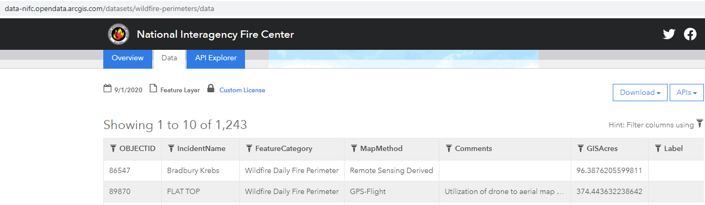
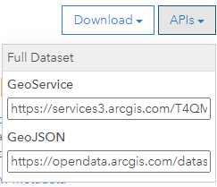

# GeoProcessor / EsriWFS

* [Overview](#overview)
* [Esri WFS and Standard GeoLayer Properties](#esri-wfs-and-standard-geolayer-properties)
* [Limitations](#limitations)

----------------

## Overview ##

Esri Web Feature Service (WFS) services allow querying spatial data layers over the web,
which can eliminate the need to download, process, and upload datasets,
especially for web applications that are deployed to the cloud.
Esri Web Feature Services implement the OGC WFS standard and provide additional functionality,
although it can be difficult to understand where OGC WFS standard and
Esri implementation differ.

The following are resources that explain the specification:

* [Web Feature Service on Wikipedia](https://en.wikipedia.org/wiki/Web_Feature_Service#:~:text=The%20basic%20Web%20Feature%20Service,web%20feature%20server%20using%20HTTP.)
* [OGC Web Feature Service](https://www.ogc.org/standards/wfs) interface standard
* [ArcGIS REST API](https://developers.arcgis.com/rest/services-reference/query-feature-service-layer-.htm)
* [GDAL OGC WFS driver](https://gdal.org/drivers/vector/wfs.html#vector-wfs)

Use of the Esri WFS API may be complicated and require special software,
especially to query service metadata, handle paging of data records,
specify combinations of query parameters, and handle different output formats.
Instead of using the full API features,
it is often easier to use minimal API features and request a simple format such as GeoJSON as output,
in which case the GeoProcessor
[`ReadGeoLayerFromGeoJSON`](../../command-ref/ReadGeoLayerFromGeoJSON/ReadGeoLayerFromGeoJSON.md) command can be
used with a URL as the file parameter.
For example, the following web page provides access to active wildfire perimeters using an Esri FWS:

[https://data-nifc.opendata.arcgis.com/datasets/wildfire-perimeters](https://data-nifc.opendata.arcgis.com/datasets/wildfire-perimeters)

The following illustrates the ***Data*** tab and corresponding web browser URL:

**

**

**

Esri FWS Data View (<a href="../data-view.png">see full-size image</a>)

**

Note that the ***Data*** tab displays the number of features (in this example 1,243),
which can be compared to the number returned from the service to evaluate if all
features are being returned.

The website provides access to data via two APIs:

* GeoService
* GeoJSON

as shown in the following image:

**

**

**

Esri FWS Dataset APIs (<a href="../download-apis.png">see full-size image</a>)

**

These alternatives are discussed in the following sections.

### GeoService Query

The GeoService option uses the
[ArcGIS REST API](https://developers.arcgis.com/rest/services-reference/query-feature-service-layer-.htm),
and allows output to multiple formats, including GeoJSON.  The full URL (second URL below) can be used with the
[`ReadGeoLayerFromGeoJSON`](../../command-ref/ReadGeoLayerFromGeoJSON/ReadGeoLayerFromGeoJSON.md) command to retrieve the FWS as GeoJSON.

* Query builder with URL ending in `query`:
  [https://services3.arcgis.com/T4QMspbfLg3qTGWY/ArcGIS/rest/services/Public_Wildfire_Perimeters_View/FeatureServer/0/query](https://services3.arcgis.com/T4QMspbfLg3qTGWY/ArcGIS/rest/services/Public_Wildfire_Perimeters_View/FeatureServer/0/query)
* Query URL from builder, with only key parameters - **clicking on URL may return a large GeoJSON response**:
  [https://services3.arcgis.com/T4QMspbfLg3qTGWY/ArcGIS/rest/services/Public_Wildfire_Perimeters_View/FeatureServer/0/query?resultType=standard&geometry=-170.0%2C17.5%2C-64.0%2C71.5&geometryType=esriGeometryEnvelope&inSR=4326&spatialRel=esriSpatialRelContains&outFields=*&geometryPrecision=5&f=geojson](https://services3.arcgis.com/T4QMspbfLg3qTGWY/ArcGIS/rest/services/Public_Wildfire_Perimeters_View/FeatureServer/0/query?resultType=standard&geometry=-170.0%2C17.5%2C-64.0%2C71.5&geometryType=esriGeometryEnvelope&inSR=4326&spatialRel=esriSpatialRelContains&outFields=*&geometryPrecision=5&f=geojson)

Advantages of the GeoService query approach are:

* Provides many query options to control feature selection and output format
* Provides several output formats, including GeoJSON
* Precision of coordinates in GeoJSON output can be specified,
  thereby controlling the size of the file

Disadvantages of the GeoService query approach are:

* The number of features returned may be restricted to a maximum (e.g., 1000 for this example, when the actual number of features is 1,243),
  which may limit use in some applications.
  Although API documentation explains ways to overcome this limitation,
  it may not be possible without changing the dataset properties on the server.
* The query builder that is provided for the URL
  (URL ending in `query` without query parameters) is complex
  and by default creates a URL containing all parameters,
  even if they have no values.
* The documentation for the API can be difficult to understand,
  including default values and interactions between parameters.

### GeoJSON Dataset

The GeoJSON download option provides access to a dataset.  The following is an example URL,
which **may return a large GeoJSON file**:

* [https://opendata.arcgis.com/datasets/5da472c6d27b4b67970acc7b5044c862_0.geojson](https://opendata.arcgis.com/datasets/5da472c6d27b4b67970acc7b5044c862_0.geojson)

Note that the above URL includes a `datasets` folder rather than `query`.

Advantages of the GeoJSON dataset approach are:

* URL to a GeoJSON file is simpler than FWS `query` API.
* Entire dataset may be available without limit on feature count.

Disadvantages of the GeoJSON dataset approach are:

* If the dataset covers an area that is larger than necessary,
  there is no way to filter the result via the URL,
  unless smaller datasets are published.
  The alternative is to use the FWS `query` API,
  especially if the number of features is less than the maximum allowed for a query.
* there is no way to control the GeoJSON contents, such as precision on coordinates and
  filtering attributes, which can lead to larger file sizes

## Esri FWS and Standard GeoLayer Properties ##

Using the FWS approach generally works well if the returned dataset leads to good application performance.
If GeoJSON format is used:

* the feature geometry is indicated in the GeoJSON file
* attributes are returned for each feature
* the CRS is standardized for GeoJSON

See the [GeoJSON](../GeoJSON/GeoJSON.md) format for more information.

## Limitations ##

* Limitations of Esri FWS are  discussed in the [Overview](#overview) section.
* Limitations of GeoJSON are discussed in the [GeoJSON](../GeoJSON/GeoJSON.md) documentation.
* It can be difficult to understand the difference between OGC FWS Standard and Esri FWS implementation.
