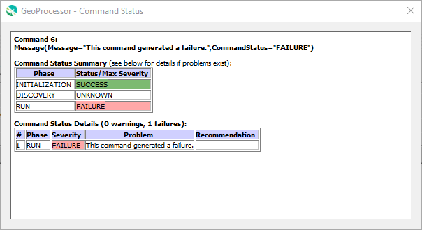

# GeoProcessor / Troubleshooting #

The GeoProcessor is a Python application that uses Python modules, including:

* GeoProcessor UI that uses PyQt
* GeoProcessor commands and processing libraries
* software that is part of the underlying GIS software (QGIS and ArcGIS Pro, depending on GeoProcessor version)
* third-party Python packages

Consequently, errors can occur in various software components.
The following topics are useful for troubleshooting software issues:

* [Log File](#log-file)
* [Command Status/Log](#command-statuslog)
* [Specific Issues](#specific-issues)
* [Software Startup Issues](#software-startup-issues)
* [Repository Issue Tracking](#repository-issue-tracking)

--------------------

## Log File ##

The GeoProcessor uses the Python logging features to create a log file that is helpful to troubleshoot issues.
However, although log files may be helpful to software developers, they can be difficult for others to understand.
The log file exists in the following locations:

* Startup log file in user's home folder GeoProcessor files, for example (`1` indicates the GeoProcessor major version):
    + Windows: `C:\Users\user\.owf-gp\1\logs\gp_user.log`
    + Linux:  `/home/user/.owf-gp/1/logs/gp_user.log`
    + Cygwin:  `/cygdrive/C/Users/user/.owf-gp/1/logs/gp_user.log` (different files from Windows)
    + Git Bash (MinGW):  `/c/Users/user/.owf-gp/1/logs/gp_user.log` (same files as Windows)
* File specified by the GeoProcessor [StartLog](../command-ref/StartLog/StartLog.md) command.

The log files can be viewed using the ***Tools / View Log File*** and ***Tools / View Startup Log File*** menu items.

The log file contains a sequential record of log messages for application startup followed by
output from running the commands, as shown in the following example.
The first part of the line indicates the message type, which can be one of the following,
shown in increasing severity and therefore decreasing frequency:  `DEBUG`, `INFO`, `WARNING`, `ERROR`, and `CRITICAL`.
Typically, one should expect very few or no `CRITICAL` messages.  Any message of level `WARNING`, `ERROR`, or `CRITICAL`
should be dealt with because they can lead to a proliferation of problems in later commands.

```txt
INFO|geoprocessor|log line 151|Opened new log file: "C:\Users\sam\owf-dev\GeoProcessor\git-repos\owf-app-geoprocessor-python-test\test\commands\RemoveFile\results\test-RemoveFile.gp.log"
INFO|geoprocessor.core.GeoProcessor|GeoProcessor line 547|-> Start processing command 2 of 5: # Test removing a file
INFO|geoprocessor.core.GeoProcessor|GeoProcessor line 547|-> Start processing command 3 of 5: # Uncomment the following line to regenerate expected results
INFO|geoprocessor.core.GeoProcessor|GeoProcessor line 547|-> Start processing command 4 of 5: CopyFile(SourceFile="data/testfile.txt",DestinationFile="results/test-RemoveFile-out.txt")
INFO|geoprocessor.commands.util.CopyFile|CopyFile line 144|Copying file "C:\Users\sam\owf-dev\GeoProcessor\git-repos\owf-app-geoprocessor-python-test\test\commands\RemoveFile\data\testfile.txt" to "C:\Users\sam\owf-dev\GeoProcessor\git-repos\owf-app-geoprocessor-python-test\test\commands\RemoveFile\results\test-RemoveFile-out.txt"
INFO|geoprocessor.core.GeoProcessor|GeoProcessor line 547|-> Start processing command 5 of 5: RemoveFile(SourceFile="results/test-RemoveFile-out.txt")
INFO|geoprocessor.commands.util.RemoveFile|RemoveFile line 120|Removing file "C:\Users\sam\owf-dev\GeoProcessor\git-repos\owf-app-geoprocessor-python-test\test\commands\RemoveFile\results\test-RemoveFile-out.txt"
INFO|geoprocessor|gp line 188|GeoProcessor properties after running:
INFO|geoprocessor|gp line 190|UserName = sam
INFO|geoprocessor|gp line 190|ComputerName = colorado
INFO|geoprocessor|gp line 190|InstallDirURL = None
INFO|geoprocessor|gp line 190|OutputStart = None
INFO|geoprocessor|gp line 190|InitialWorkingDir = C:\Users\sam\owf-dev\GeoProcessor\git-repos\owf-app-geoprocessor-python-test\test\commands\RemoveFile
INFO|geoprocessor|gp line 190|WorkingDir = C:\Users\sam\owf-dev\GeoProcessor\git-repos\owf-app-geoprocessor-python-test\test\commands\RemoveFile
INFO|geoprocessor|gp line 190|InputStart = None
INFO|geoprocessor|gp line 190|OutputEnd = None
INFO|geoprocessor|gp line 190|UserHomeDir = C:\Users\sam
INFO|geoprocessor|gp line 190|ProgramVersionString = None
INFO|geoprocessor|gp line 190|TempDir = c:\users\sam\appdata\local\temp
INFO|geoprocessor|gp line 190|ComputerTimezone = Mountain Standard Time
INFO|geoprocessor|gp line 190|InputEnd = None
INFO|geoprocessor|gp line 190|InstallDir = None
INFO|geoprocessor|gp line 190|OutputYearType = None
INFO|geoprocessor|gp line 190|UserHomeDirURL = file:///C:/Users/sam
INFO|geoprocessor|gp line 190|ProgramVersionNumber = None
```
The GeoProcessor UI allows the log file to be displayed using the ***Tools / View Log File*** menu.

Log files created by the [StartLog](../command-ref/StartLog/StartLog.md) command
are also typically listed in ***Results / Output Files*** in the
[GeoProcessor test repository](https://github.com/OpenWaterFoundation/owf-app-geoprocessor-python-test).

## Command Status/Log ##

The GeoProcessor user interface displays command-specific warning messages,
which indicate problems that need to be resolved.
A command flagged with red X or yellow warning symbol can be reviewed to determine problems.

**<p style="text-align: center;">

</p>**

**<p style="text-align: center;">
GeoProcessor User Interface showing Warning and Failure Indicators (<a href="../images/ui-with-warnings.png">see full-size image</a>)
</p>**

A command's log can be displayed by mousing over the icon at the left of the commands list or
right-clicking on a command and selecting the
***Show Command Status*** menu, which will display a summary similar to the following.
Initialization issues occur when a command is first parsed.
Discovery issues are not currently used but may be implemented in the future to indicate partial-run issues - discovery
mode is used to generation information used by other command editors.
Run issues are generated when a command is run.

**<p style="text-align: center;">

</p>**

**<p style="text-align: center;">
Command Status Log Summary (<a href="../images/command-status.png">see full-size image</a>)
</p>**

## Specific Issues ##

Information will be inserted here for specific known issues as such issues are identified.

## Software Startup Issues ##

Software startup issues may result from unforseen bugs or software component version conflicts.
Contact support via the repository issues page to report issues.

* See the [GeoProcessor repository issues page](https://github.com/OpenWaterFoundation/owf-app-geoprocessor-python/issues)
* See the [GeoProcessor Developer Documentation Troubleshooting](http://software.openwaterfoundation.org/geoprocessor/latest/doc-dev/troubleshooting/troubleshooting/) documentation

## Repository Issue Tracking ##

An issue may be due to a software bug or planned enhancement.
See the [GeoProcessor GitHub repository issues](https://github.com/OpenWaterFoundation/owf-app-geoprocessor-python/issues)
for a list of know issues.
New bugs and feature requests can be added to alert developers.
